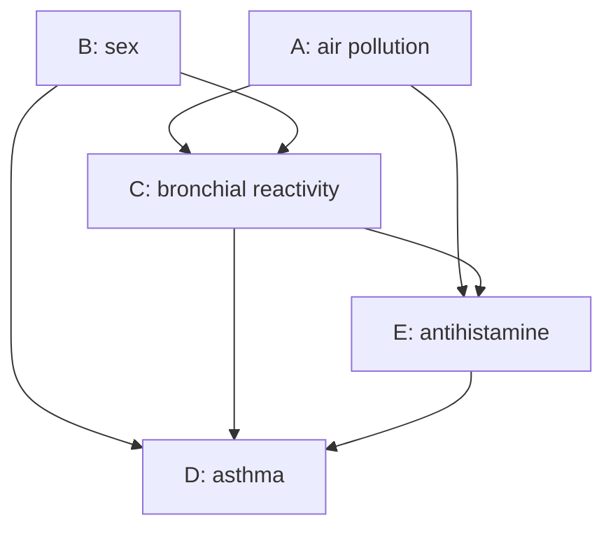
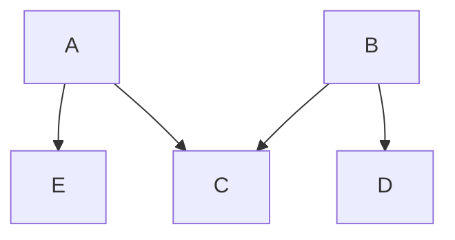

# Chapter 10: Foundations of Causal Inference (Potential Outcomes, Identification, Estimation, and Causal Graphs)

In the previous chapters of statistical learning, we focused more on the association between variables, predictive ability, and generalization error. However, in problems such as medicine, public policy, economics, social sciences, and recommendation systems, researchers are often genuinely interested in: how would the outcome change if a treatment, policy, or exposure were actively changed? Such questions cannot be answered solely by conditional association or predictive accuracy; they require the language of **intervention**, **counterfactuals**, and **identifiability**.

This chapter systematically introduces two main threads of modern causal inference. The first is the **Rubin Potential Outcomes Framework**: using $Y^1,Y^0$ to define individual and population causal effects, explaining the fundamental missing-data difficulty of causal inference, and deriving identification and estimation formulas such as G-formula, IPTW, AIPW, and G-estimation under assumptions of consistency, positivity, and randomization or conditional exchangeability. The second is the **Pearl Causal Graph Framework**: using DAGs to express direct causal relationships between variables, using backdoor paths, colliders, d-separation, and the backdoor path criterion to determine which variables should be adjusted and which should not. Both languages ultimately serve the same goal: transforming causal quantities that cannot be directly observed into statistical functionals that can be estimated from observational data.

---

## 1. Potential Outcomes Framework (Counterfactuals / Potential Outcomes)

The core of causal inference lies in comparing the difference in an individual's outcome under "receiving an intervention" versus "not receiving an intervention".

!!! info "Definition 1.1 (Potential Outcomes and Observed Outcome)"

    Let the binary intervention variable be $A \in \{0, 1\}$, where $A = 1$ indicates receiving a treatment/intervention (e.g., taking a drug) and $A = 0$ indicates not receiving it (e.g., taking a placebo).
  
    For each individual, we define two **potential outcomes**:
  
    * $Y^1$: the outcome that would occur if the individual received the intervention ($A=1$).
    * $Y^0$: the outcome that would occur if the individual did not receive the intervention ($A=0$).
  
    In the real world, for any individual, we can only observe one of the two intervention states. The actually observed response variable $Y$ satisfies the following **consistency** relationship with the potential outcomes:
  
    \[
    Y = A Y^1 + (1 - A) Y^0
    \]

### 1.1 The Fundamental Problem of Causal Inference

Since the definition of a causal effect relies on comparing $Y^1$ and $Y^0$ for the same individual at the same time, and in reality at least one of $Y^1$ and $Y^0$ is an unobservable counterfactual, **causal effects at the individual level can never be directly observed or computed**.

To overcome this difficulty, statistics shifts the perspective from "individual causal effects" to "population average causal effects".

---

## 2. Statistical Measures of Causal Effects

At the population level, we define solvable causal metrics by taking expectations over the potential outcomes.

!!! info "Definition 2.1 (Average Treatment Effect, ATE, and Conditional Average Treatment Effect, CATE)"

    * **Average Causal Effect (ATE)**: defined as the absolute difference in the expected potential outcomes under the two treatments for the entire population:
  
    \[
    \text{ATE} = \mathbb{E}[Y^1 - Y^0] = \mathbb{E}[Y^1] - \mathbb{E}[Y^0]
    \]
  
    * **Conditional Average Causal Effect (CATE)**: if there exists a set of multidimensional covariates/confounders $X \in \mathbb{R}^p$, the average causal effect within a specific subpopulation $X=x$ is defined as:
  
    \[
    \text{CATE}(x) = \mathbb{E}[Y^1 - Y^0 \mid X = x]
    \]

### 2.1 The Fundamental Difference between Correlation and Causation

In observational data, we can often only directly compute the difference in observed conditional expectations, i.e., the **association measure**:

$$
\text{Association} = \mathbb{E}[Y \mid A = 1] - \mathbb{E}[Y \mid A = 0]
$$

In general, $\mathbb{E}[Y \mid A = 1] - \mathbb{E}[Y \mid A = 0] \neq \mathbb{E}[Y^1] - \mathbb{E}[Y^0]$.

This is because, in observational data, due to the presence of confounders, the assignment of intervention $A$ is often not independent of the potential outcomes $(Y^1, Y^0)$. For example, patients with more severe illness (whose potential health $Y^0$ is lower) are more likely to choose medication ($A=1$).

---

## 3. Identifiability of Causal Effects

To transform causal quantities containing unobservable terms (such as $\mathbb{E}[Y^1]$) into statistical quantities that depend only on observable sample data, we need three core identifiability assumptions.

!!! info "Definition 3.1 (Three Core Identifiability Assumptions)"

    1. **Consistency**: As described above, the observed value is exactly equal to the corresponding potential outcome: when $A=a$, $Y = Y^a$.
  
    2. **Positivity / Overlap**: For any value of the covariate $X$, the probability of receiving each intervention must be strictly between 0 and 1:
  
    \[
    0 < P(A = 1 \mid X = x) < 1, \quad \forall x
    \]
  
    3. **Conditional Exchangeability / Unconfoundedness**: After controlling for the observable covariates $X$, the intervention assignment is independent of the potential outcomes:
  
    \[
    (Y^1, Y^0) \perp \! \! \! \perp A \mid X
    \]

### 3.1 Causal Identification Theorem via Stratification

!!! note "Theorem 3.1 (Causal Identification Theorem / Adjustment Formula)"

    Under the assumptions of consistency, positivity, and conditional exchangeability, the population average potential outcome $\mathbb{E}[Y^a]$ (for $a \in \{0, 1\}$) is fully identifiable, and its formula in terms of the observable data distribution is:
  
    \[
    \mathbb{E}[Y^a] = \mathbb{E}_X \left[ \mathbb{E}[Y \mid A = a, X] \right] = \int \mathbb{E}[Y \mid A = a, X = x] dF_X(x)
    \]

??? proof "Proof: Mathematical Derivation of the Causal Identification Theorem"

    By the law of total expectation, first condition on the covariates $X$:
  
    \[
    \mathbb{E}[Y^a] = \mathbb{E}_X \left[ \mathbb{E}[Y^a \mid X] \right]
    \]
  
    Next, use the third assumption, **conditional exchangeability** $(Y^1, Y^0) \perp \! \! \! \perp A \mid X$. This implies that, given $X$, the expectation of the potential outcome $Y^a$ is independent of the actual treatment status $A=a$. Therefore, we can condition on $A=a$:
  
    \[
    \mathbb{E}[Y^a \mid X] = \mathbb{E}[Y^a \mid A = a, X]
    \]
  
    Then, apply the **consistency** assumption: when the treatment is fixed to $A=a$, the potential outcome $Y^a$ can be replaced by the actually observed outcome $Y$:
  
    \[
    \mathbb{E}[Y^a \mid A = a, X] = \mathbb{E}[Y \mid A = a, X]
    \]
  
    Substituting back into the outer expectation yields:
  
    \[
    \mathbb{E}[Y^a] = \mathbb{E}_X \left[ \mathbb{E}[Y \mid A = a, X] \right]
    \]
  
    This completes the proof. All probability distributions and conditional expectations on the right-hand side can be directly estimated from the observed dataset $\mathcal{D}_n = \{(X_i, A_i, Y_i)\}_{i=1}^n$.

---

## 4. Propensity Score

When the dimension $p$ of the covariates $X$ is high, directly performing multidimensional integration or nonparametric stratification based on the theorem above encounters the severe "curse of dimensionality". To address this computational difficulty, the propensity score is introduced as a one-dimensional dimension-reduction tool.

!!! info "Definition 4.1 (Propensity Score)"

    The propensity score is defined as the conditional probability of receiving the intervention ($A=1$) given the individual's characteristics $X$, denoted $e(X)$:
  
    \[
    e(X) = P(A = 1 \mid X)
    \]
  
    Typically, the propensity score can be estimated by fitting a logistic regression model to the observed data.

### 4.1 Balancing Score Property

The propensity score is a remarkably effective dimension-reduction functional that naturally possesses the following "balancing" property.

!!! note "Theorem 4.1 (Balancing Score Theorem)"

    Given the propensity score $e(X)$, the original multidimensional features $X$ are conditionally independent of the treatment assignment $A$:
  
    \[
    X \perp \! \! \! \perp A \mid e(X)
    \]
  
    This means that within subpopulations with the same propensity score, the feature distributions of the treated and control groups are statistically balanced, achieving an effect similar to that of a randomized controlled trial (RCT).

---

## 5. Inverse Probability Treatment Weighting (IPTW)

Inverse Probability Treatment Weighting (IPTW) is a classic nonparametric/semiparametric estimation method that uses the propensity score to correct for selection bias due to confounders. Its core idea is to assign each sample a weight inversely proportional to the probability of receiving the treatment it actually received, thereby creating a virtual "pseudo-population" in which the confounders are no longer associated with the treatment variable.

!!! note "Theorem 5.1 (IPTW Core Equivalence Theorem)"

    If consistency, positivity, and conditional exchangeability hold, then the average potential outcomes $\mathbb{E}[Y^1]$ and $\mathbb{E}[Y^0]$ can be exactly computed via the following inverse-probability-weighted observable expectations:
  
    \[
    \mathbb{E}[Y^1] = \mathbb{E}\left[ \frac{A Y}{e(X)} \right]
    \]
  
    \[
    \mathbb{E}[Y^0] = \mathbb{E}\left[ \frac{(1 - A) Y}{1 - e(X)} \right]
    \]

??? proof "Proof: Rigorous Mathematical Derivation of the IPTW Identity"

    We prove the identity for the treated group $\mathbb{E}[Y^1]$. Expand the weighted observable expectation using the law of total expectation, conditioning on $X$:
  
    \[
    \mathbb{E}\left[ \frac{A Y}{e(X)} \right] = \mathbb{E}_X \left[ \mathbb{E}\left[ \frac{A Y}{e(X)} \;\middle|\; X \right] \right]
    \]
  
    Since the denominator $e(X)$ is a deterministic function of $X$, it can be treated as a constant factor inside the conditional expectation:
  
    \[
    \mathbb{E}\left[ \frac{A Y}{e(X)} \;\middle|\; X \right] = \frac{1}{e(X)} \mathbb{E}[A Y \mid X]
    \]
  
    Apply the consistency assumption and expand $Y$ as $A Y^1 + (1 - A) Y^0$. When multiplied by $A$, note that $A(1-A)=0$ and $A^2 = A$ (since $A \in \{0, 1\}$). Hence:
  
    \[
    A Y = A (A Y^1 + (1 - A) Y^0) = A^2 Y^1 + A(1 - A) Y^0 = A Y^1
    \]
  
    Substituting back into the conditional expectation:
  
    \[
    \frac{1}{e(X)} \mathbb{E}[A Y \mid X] = \frac{1}{e(X)} \mathbb{E}[A Y^1 \mid X]
    \]
  
    Now, crucially, use the **conditional exchangeability** assumption $Y^1 \perp \! \! \! \perp A \mid X$. Under conditional independence, the expectation of a product equals the product of expectations:
  
    \[
    \mathbb{E}[A Y^1 \mid X] = \mathbb{E}[A \mid X] \cdot \mathbb{E}[Y^1 \mid X]
    \]
  
    By the definition of the propensity score, $\mathbb{E}[A \mid X] = P(A = 1 \mid X) = e(X)$. Substituting:
  
    \[
    \frac{1}{e(X)} \mathbb{E}[A Y^1 \mid X] = \frac{1}{e(X)} \cdot e(X) \cdot \mathbb{E}[Y^1 \mid X] = \mathbb{E}[Y^1 \mid X]
    \]
  
    Finally, substituting the simplified inner conditional expectation back into the outer expectation over $X$:
  
    \[
    \mathbb{E}_X \left[ \mathbb{E}\left[ \frac{A Y}{e(X)} \;\middle|\; X \right] \right] = \mathbb{E}_X \left[ \mathbb{E}[Y^1 \mid X] \right] = \mathbb{E}[Y^1]
    \]
  
    This completes the proof. The derivation for the control group $\mathbb{E}\left[ \frac{(1 - A) Y}{1 - e(X)} \right] = \mathbb{E}[Y^0]$ follows analogously.

Through this identity, the population average treatment effect ATE can be uniformly written in the IPTW framework as:

$$
\text{ATE} = \mathbb{E}\left[ \frac{A Y}{e(X)} - \frac{(1 - A) Y}{1 - e(X)} \right]
$$

In practical sample calculations, we often use the corresponding empirical sample mean form (Horvitz-Thompson estimator):

$$
\widehat{\text{ATE}}_{\text{IPTW}} = \frac{1}{n} \sum_{i=1}^n \frac{A_i Y_i}{\hat{e}(X_i)} - \frac{1}{n} \sum_{i=1}^n \frac{(1 - A_i) Y_i}{1 - \hat{e}(X_i)}
$$

## 6. Dual Representation of the IPTW Estimator

In practice, we can also understand and compute IPTW using conditional expectations.

!!! note "Theorem 6.1 (Smoothing Property of IPTW)"

    Let $Y$ be the observed outcome, $A$ the binary treatment, and $e(X) = P(A=1 \mid X)$ the propensity score. Then the two parts of the IPTW operator satisfy the following dual integral representations:
  
    \[
    \mathbb{E}\left[ \frac{A Y}{e(X)} \right] = \mathbb{E}\left[ \frac{A \cdot \mathbb{E}[Y \mid A=1, X]}{e(X)} \right]
    \]
  
    \[
    \mathbb{E}\left[ \frac{(1 - A) Y}{1 - e(X)} \right] = \mathbb{E}\left[ \frac{(1 - A) \cdot \mathbb{E}[Y \mid A=0, X]}{1 - e(X)} \right]
    \]

??? proof "Proof: Derivation of the IPTW Dual Equality"

    Using the law of iterated expectations, condition on $X$:
  
    \[
    \mathbb{E}\left[ \frac{A Y}{e(X)} \right] = \mathbb{E}_X \left[ \mathbb{E}\left[ \frac{A Y}{e(X)} \;\middle|\; X \right] \right] = \mathbb{E}_X \left[ \frac{1}{e(X)} \mathbb{E}[A Y \mid X] \right]
    \]
  
    Expand $\mathbb{E}[A Y \mid X]$ using the law of total expectation over $A \in \{0,1\}$:
  
    \[
    \mathbb{E}[A Y \mid X] = P(A=1 \mid X) \cdot \mathbb{E}[A Y \mid A=1, X] + P(A=0 \mid X) \cdot \mathbb{E}[A Y \mid A=0, X]
    \]
  
    When $A=1$, $A Y = Y$; when $A=0$, $A Y = 0$. Hence the second term vanishes. Substituting $P(A=1 \mid X) = e(X)$:
  
    \[
    \mathbb{E}[A Y \mid X] = e(X) \cdot \mathbb{E}[Y \mid A=1, X]
    \]
  
    Now construct the same quantity from the expression on the right. Since $A$ is binary and $\mathbb{E}[Y \mid A=1, X]$ is a deterministic function of $X$:
  
    \[
    \mathbb{E}[A \cdot \mathbb{E}[Y \mid A=1, X] \mid X] = \mathbb{E}[Y \mid A=1, X] \cdot \mathbb{E}[A \mid X] = \mathbb{E}[Y \mid A=1, X] \cdot e(X)
    \]
  
    Thus:
  
    \[
    \mathbb{E}[A Y \mid X] = \mathbb{E}[A \cdot \mathbb{E}[Y \mid A=1, X] \mid X]
    \]
  
    Substituting this identity into the outer expectation:
  
    \[
    \mathbb{E}\left[ \frac{A Y}{e(X)} \right] = \mathbb{E}\left[ \frac{A \cdot \mathbb{E}[Y \mid A=1, X]}{e(X)} \right]
    \]
  
    This completes the proof.

---

## 7. Standardization / G-Formula

Standardization (also called conditional regression extrapolation) is another fundamental method for identifying the ATE. It directly models the regression surface $m(a, x) = \mathbb{E}[Y \mid A=a, X=x]$.

!!! info "Definition 7.1 (Standardization Estimator)"

    Fitting the observed regression model $\hat{m}(a, x)$, the standardization estimator of the population average treatment effect is:
  
    \[
    \widehat{\text{ATE}}_{\text{Std}} = \frac{1}{n} \sum_{i=1}^n \hat{m}(1, X_i) - \frac{1}{n} \sum_{i=1}^n \hat{m}(0, X_i)
    \]

* **Philosophical Comparison of IPTW and Standardization**:
  * IPTW focuses on the treatment assignment model (Propensity Score), aiming to rebalance the feature distributions between the two groups.
  * Standardization focuses on the outcome model, directly extrapolating conditional expectations to estimate counterfactuals.

---

## 8. Marginal Structural Models (MSM)

When dealing with continuous treatments, time-varying multiple interventions, or when one wishes to impose a parametric regression structure on potential outcomes, plain IPTW is not directly applicable. Marginal Structural Models (MSM) are introduced for such scenarios.

!!! info "Definition 8.1 (Marginal Structural Model)"

    A marginal structural model is a model directly on the **marginal expectation of potential outcomes**. For example, for binary or continuous treatment $A$, a classic linear MSM takes the form:
  
    \[
    \mathbb{E}[Y^a] = \beta_0 + \beta_1 a
    \]
  
    Here, the parameter $\beta_1$ has a purely causal interpretation: $\beta_1 = \mathbb{E}[Y^1] - \mathbb{E}[Y^0] = \text{ATE}$.

### 8.1 Weighted Least Squares Estimation in a Pseudo-Population

In observational data, due to confounding, directly fitting $Y = \beta_0 + \beta_1 A + \epsilon$ on the original data yields a biased $\beta_1$. MSM achieves unbiased estimation by solving the following **Weighted Least Squares (WLS)** problem:

$$
\min_{\beta_0, \beta_1} \sum_{i=1}^n W_i \left( Y_i - \beta_0 - \beta_1 A_i \right)^2
$$

where the sample weights are typically the **stabilized weights**:

$$
W_i = \frac{P(A = A_i)}{\hat{e}(X_i)^{A_i} (1 - \hat{e}(X_i))^{1 - A_i}}
$$

---

## 9. Doubly Robust Estimation

To combine the advantages of both the propensity score model and the outcome regression model, statisticians have developed the Doubly Robust (DR) estimator. The key property is that if **at least one of** the propensity score model and the outcome regression model is correctly specified, the estimator is unbiased.

!!! info "Definition 9.1 (Doubly Robust Estimator Expression)"

    The doubly robust estimator for $\mathbb{E}[Y^1]$ is given by:
  
    \[
    \hat{\mu}_{\text{DR}}^1 = \frac{1}{n} \sum_{i=1}^n \left[ \frac{A_i Y_i}{\hat{e}(X_i)} - \frac{A_i - \hat{e}(X_i)}{\hat{e}(X_i)} \hat{m}(1, X_i) \right]
    \]

!!! note "Theorem 9.1 (Doubly Robustness Theorem)"

    Under consistency, positivity, and conditional exchangeability, if either the propensity score model $e(X)$ is correctly specified **or** the outcome regression model $m(1, X)$ is correctly specified, then $\hat{\mu}_{\text{DR}}^1$ is asymptotically unbiased, i.e., $\mathbb{E}[\hat{\mu}_{\text{DR}}^1] = \mathbb{E}[Y^1]$.

??? proof "Proof: Dual-Model Robustness of the Doubly Robust Estimator"

    Rewrite the DR estimator in a more intuitive algebraic form:
  
    \[
    \hat{\mu}_{\text{DR}}^1 = \frac{1}{n} \sum_{i=1}^n \left[ \hat{m}(1, X_i) + \frac{A_i (Y_i - \hat{m}(1, X_i))}{\hat{e}(X_i)} \right]
    \]
  
    We consider two worst-case scenarios and show that in each case the expectation converges to $\mathbb{E}[Y^1]$.
  
    **Case 1: The outcome regression model $\hat{m}$ is correctly specified, but the propensity score model $\hat{e}$ is misspecified.**
  
    Since $\hat{m}(1, X) = \mathbb{E}[Y \mid A=1, X]$ holds exactly, take the conditional expectation of the second term given $(A, X)$:
  
    \[
    \mathbb{E}\left[ \frac{A (Y - \hat{m}(1, X))}{\hat{e}(X)} \;\middle|\; A, X \right] = \frac{A}{\hat{e}(X)} \mathbb{E}[Y - \hat{m}(1, X) \mid A, X]
    \]
  
    When $A=1$:
  
    \[
    \mathbb{E}[Y - \hat{m}(1, X) \mid A=1, X] = \mathbb{E}[Y \mid A=1, X] - \hat{m}(1, X) = 0
    \]
  
    When $A=0$, the factor $A=0$ makes the whole term zero.
  
    Therefore, regardless of the (wrong) $\hat{e}(X)$, the expectation of the second term is always zero. The overall expectation becomes:
  
    \[
    \mathbb{E}[\hat{\mu}_{\text{DR}}^1] = \mathbb{E}_X [\hat{m}(1, X)] + 0 = \mathbb{E}_X [ \mathbb{E}[Y^1 \mid X] ] = \mathbb{E}[Y^1]
    \]
  
    **Case 2: The propensity score model $\hat{e}$ is correctly specified, but the outcome regression model $\hat{m}$ is misspecified.**
  
    Here $\hat{e}(X) = e(X) = P(A=1 \mid X)$. Expand the expectation of the DR estimator:
  
    \[
    \mathbb{E}[\hat{\mu}_{\text{DR}}^1] = \mathbb{E}\left[ \hat{m}(1, X) \right] + \mathbb{E}\left[ \frac{A Y}{e(X)} \right] - \mathbb{E}\left[ \frac{A \hat{m}(1, X)}{e(X)} \right]
    \]
  
    Using the **dual representation theorem of IPTW** from Section 6, the last term can be transformed:
  
    \[
    \mathbb{E}\left[ \frac{A \hat{m}(1, X)}{e(X)} \right] = \mathbb{E}_X \left[ \frac{\mathbb{E}[A \mid X] \hat{m}(1, X)}{e(X)} \right] = \mathbb{E}_X \left[ \frac{e(X) \hat{m}(1, X)}{e(X)} \right] = \mathbb{E}\left[ \hat{m}(1, X) \right]
    \]
  
    Substituting back:
  
    \[
    \mathbb{E}[\hat{\mu}_{\text{DR}}^1] = \mathbb{E}\left[ \hat{m}(1, X) \right] + \mathbb{E}\left[ \frac{A Y}{e(X)} \right] - \mathbb{E}\left[ \hat{m}(1, X) \right] = \mathbb{E}\left[ \frac{A Y}{e(X)} \right]
    \]
  
    Since the propensity score model is correct, the IPTW identification theorem ensures that this equals $\mathbb{E}[Y^1]$.
  
    Combining both cases proves double robustness.

---

## 10. G-Estimation (of Structural Nested Models)

G-estimation is a more advanced semi-parametric causal inference technique for Structural Nested Models (SNMs). Its core idea is to find the causal parameter such that the counterfactual outcome is independent of the treatment assignment.

!!! info "Definition 10.1 (Basic Setup of Structural Nested Model)"

    Consider a parametric nested form for the conditional average causal effect CATE:
  
    \[
    \mathbb{E}[Y^1 - Y^0 \mid A=1, X] = \psi \cdot X
    \]
  
    This implies that the parameter $\psi$ captures the moderation (interaction) effect of covariates $X$ on the causal effect.

### 10.1 Estimating Equation under the Zero Causal Association

To solve for the unknown causal parameter $\psi$, we use the conditional exchangeability assumption: $Y^0 \perp \! \! \! \perp A \mid X$. This means that the counterfactual zero-state outcome $Y^0$ should have no predictive power for the treatment assignment $A$ after controlling for $X$.

We construct for each individual an estimate of their counterfactual outcome:

$$
H_i(\psi) = Y_i - A_i \cdot (\psi \cdot X_i)
$$

Under the unconfoundedness assumption, when $\psi$ takes its true value, the following orthogonality (estimating) equation must hold:

$$
\mathbb{E}\left[ (A - e(X)) \cdot H(\psi) \;\middle|\; X \right] = 0
$$

By forming the corresponding empirical estimating equation on the sample data and setting it to zero:

$$
\frac{1}{n} \sum_{i=1}^n (A_i - \hat{e}(X_i)) \cdot \left( Y_i - A_i \psi X_i \right) = 0
$$

From this, we can directly solve for an unbiased estimate of the causal parameter $\psi$ via a closed-form expression (or by fitting generalized estimating equations, GEE).

---

## 11. Causal Diagrams

Sections 1–10 mainly used the potential outcomes framework to define causal quantities, explain identification assumptions, and present estimation methods such as standardization, IPTW, doubly robust estimation, and G-estimation. Starting from this section, we introduce another equally important language: **causal diagrams**. The role of causal diagrams is not to replace potential outcomes, but to use graph structures to clearly express direct causal relationships between variables, confounding paths, collider structures, and the set of covariates that should be adjusted.

!!! info "Main Thread for the Latter Part of This Chapter"

    The core questions addressed by causal diagrams are:
  
    1. How to use a directed graph to represent the researcher's scientific assumptions about the causal structure;
    2. How to read statistical independence and conditional independence from the graph;
    3. How to determine whether confounding exists between the exposure and outcome variables;
    4. How to use **d-separation** and the **backdoor path criterion** to find an adjustment set sufficient to control confounding.

### 11.1 The Antihistamine and Asthma Example

Consider a hypothetical study on the relationship between **antihistamine use** and **asthma occurrence** among first-grade children. Define the following variables:

Let air pollution level be denoted $A$, sex denote $B$, bronchial reactivity denote $C$, asthma denote $D$, and antihistamine use denote $E$. Suppose the researcher has the following background knowledge:

1. Air pollution level $A$ and sex $B$ are independent;
2. The effect of sex $B$ on antihistamine use $E$ is entirely mediated through bronchial reactivity $C$, but $B$ directly affects asthma risk $D$;
3. Industrial air pollution $A$ leads to asthma only through antihistamine use $E$ and bronchial reactivity $C$; there is no direct $A \to D$ effect;
4. Apart from sex $B$, bronchial reactivity $C$, and air pollution $A$, there are no other important confounders.

These assumptions can be represented by the following directed graph:

!!! info "Definition 11.1 (Basic Objects in a Graph)"

    In a causal graph:
  
    * The points representing variables are called **vertices** or **nodes**;
    * The lines or arrows connecting two variables are called **edges** or **arcs**;
    * An arrow $X \to Y$ denotes a **direct causal link** from cause to effect, meaning that this part of the influence of $X$ on $Y$ does not pass through other variables in the graph.

For example, $A \to C$ indicates that air pollution $A$ has a direct causal effect on bronchial reactivity $C$; the absence of an arrow between $A$ and $D$ expresses "there is no direct causal effect of $A$ on $D$", meaning that the effect of pollution on asthma occurs through intermediate variables such as $C$ or $E$.

### 11.2 Paths, Ancestors, Parents, and Children

!!! info "Definition 11.2 (Path and Interception)"

    A sequence of nodes connected by edges is called a **path**. If an intermediate node lies on that path, it is said to **intercept** the path.
  
    For example, $C$ intercepts the path
  
    \[
    A - C - D
    \]
  
    as well as the path
  
    \[
    E - C - D.
    \]

!!! info "Definition 11.3 (Ancestors, Descendants, Parents, and Children)"

    If there exists a directed path from $X$ to $Y$, then $X$ is called an **ancestor** (or cause) of $Y$, and $Y$ is called a **descendant** of $X$.
  
    If there exists a single directed edge
  
    \[
    X \to Y,
    \]
  
    then $X$ is called a **parent** of $Y$, and $Y$ is called a **child** of $X$.

In the asthma DAG above, $A,B,C$ are all ancestors of $E$ and $D$; $E$ and $D$ are descendants of $A,B,C$. $A$ and $C$ are parents of $E$; $E$ is a child of $A$ and $C$. $C$ and $E$ are parents of $D$; $D$ is a child of $C$ and $E$.

### 11.3 Backdoor Paths, Colliders, and Blocking Paths

!!! info "Definition 11.4 (Backdoor Path)"

    A path connecting $X$ and $Y$ that begins with an arrow pointing into $X$ (i.e., $X$ is not the cause at the start of that path) is called a **backdoor path** from $X$ to $Y$.
  
    In other words, if we are interested in the causal effect of $X$ on $Y$, then a path that starts with
  
    \[
    X \leftarrow \cdots \cdots Y
    \]
  
    is a backdoor path. It is not a causal path emanating from $X$; it may reflect common causes of $X$ and $Y$, thereby introducing confounding.

In the diagram above, if we are interested in the causal effect of antihistamine $E$ on asthma $D$, besides the direct path

$$
E \to D,
$$

all other paths from $E$ to $D$ are backdoor paths, for example:

$$
E \leftarrow A \to C \to D,
$$

$$
E \leftarrow C \to D,
$$

$$
E \leftarrow C \leftarrow B \to D,
$$

and

$$
E \leftarrow A \to C \leftarrow B \to D.
$$

!!! info "Definition 11.5 (Collider)"

    If a path enters a node $X$ via an arrowhead and leaves that node also via an arrowhead, i.e., the local structure is
  
    \[
    U \to X \leftarrow V,
    \]
  
    then the path is said to **collide** at $X$, and $X$ is called a **collider** on that path.

!!! info "Definition 11.6 (Blocked and Unblocked Paths)"

    When no variables are conditioned on, a path that contains at least one collider is said to be **blocked**; a path that contains no colliders is said to be **unblocked**.

In the asthma DAG:

* The backdoor path

  $E \leftarrow A \to C \leftarrow B \to D$

  has a collider at $C$ ($A \to C \leftarrow B$), so this path is blocked;

* The backdoor path

  $E \leftarrow A \to C \to D$

  contains no collider, so it is unblocked;

* The backdoor path

  $E \leftarrow C \to D$

  contains no collider, so it is also unblocked.

---

## 12. Directed Acyclic Graph (DAG)

### 12.1 Definition of DAG

!!! info "Definition 12.1 (Directed Acyclic Graph, DAG)"

    A graph is called a **Directed Acyclic Graph (DAG)** if:
  
    1. **Directed**: all edges are directed arrows;
    2. **Acyclic**: there is no closed loop formed by directed paths.
  
    In a causal context, a directed path
  
    \[
    X \to \cdots \to Y
    \]
  
    represents a causal path from $X$ to $Y$.

!!! info "Definition 12.2 (Causal DAG)"

    A DAG is called a **causal DAG** if all common causes of any pair of variables in the graph are included in the graph.
  
    Note: The researcher does not need to include all real-world variables in the DAG; only those relevant to the research question and important common causes between variable pairs need be included.

### 12.2 Nonparametric Nature and Causal Implications of DAGs

A DAG itself is **nonparametric**. It does not specify functional forms between variables, nor does it assume linear models, normality, or homoscedasticity. It encodes only the following structural information:

1. Which pairs of variables have a direct causal connection;
2. Which pairs of variables do not have a direct causal connection;
3. Which paths may generate statistical association;
4. Which paths may generate confounding.

!!! note "Proposition 12.1 (Directed Paths and Causal Effects)"

    If there is no directed path from $X$ to $Y$ in the graph, then, under the structural assumptions of the causal DAG, $X$ has no causal effect on $Y$.
  
    For example, if there is no directed path $A \to \cdots \to B$ between $A$ and $B$, then $A$ has no causal effect on $B$. Furthermore, if there is no path $A \to \cdots \to B \to \cdots \to D$, then $A$ cannot have a causal effect on $D$ through $B$.

### 12.3 Statistical Independence Encoded in a DAG

A graph not only encodes causal structure but also statistical independencies between variables. Intuitively, if there is no unblocked path between two variables, they should be statistically independent.

In the asthma DAG, $A$ and $B$ have no edge between them, and the path

$$
A \to C \leftarrow B
$$

has a collider at $C$, so it is marginally blocked. Therefore, the DAG encodes

$$
A \perp\!\!\!\perp B.
$$

!!! success "Proposition 12.2 (Two Main Sources of Statistical Dependence between Variables)"

    In a causal DAG, the statistical dependence between two variables typically arises from only two reasons:
  
    1. They share a common cause, i.e., there is a confounding path;
    2. One variable is a cause of the other, or there is a directed causal path between them.

### 12.4 Markov Factorization Formula

One of the most important mathematical properties of a DAG is that it provides a factorization of the joint distribution. Let $pa(V)$ denote the set of parents of node $V$. In a DAG, the joint density can be factorized as the product of the conditional density of each node given its parents.

!!! success "Theorem 12.1 (Markov Factorization for a DAG)"

    Let the set of variables be $V_1,\dots,V_p$, and let their causal structure be described by a DAG $G$. If the joint distribution satisfies the Markov property with respect to $G$, then:
  
    \[
    f(v_1,\dots,v_p)=\prod_{j=1}^p f\bigl(v_j\mid pa(v_j)\bigr).
    \]

For the asthma example, the parent sets are:

$$
pa(A)=\varnothing,\quad pa(B)=\varnothing,
$$

$$
pa(C)=\{A,B\},\quad pa(E)=\{A,C\},\quad pa(D)=\{B,C,E\}.
$$

Thus the joint density factorizes as

$$
\begin{aligned}
f(A,E,C,B,D)
&= f(D\mid B,C,E) f(C\mid A,B) f(E\mid A,C) f(A) f(B) \\
&= f(D\mid pa(D)) f(C\mid pa(C)) f(E\mid pa(E)) f(A\mid pa(A)) f(B\mid pa(B)).
\end{aligned}
$$

??? proof "Proof: Markov Factorization for the Asthma DAG"

    For any five variables, the chain rule of probability gives
  
    \[
    f(A,E,C,B,D)
    = f(D\mid A,E,C,B) f(E\mid A,C,B) f(C\mid A,B) f(A\mid B) f(B).
    \]
  
    The local Markov property for a DAG states: each node, given its parents, is conditionally independent of its non-descendants.
  
    For $D$, its parents are $B,C,E$. Given $B,C,E$, $D$ does not require additional conditioning on $A$:
  
    \[
    f(D\mid A,E,C,B)=f(D\mid B,C,E).
    \]
  
    For $E$, its parents are $A,C$. Given $A,C$, $E$ is conditionally independent of $B$:
  
    \[
    f(E\mid A,C,B)=f(E\mid A,C).
    \]
  
    For $A$ and $B$, they have no parents and are marginally independent, so
  
    \[
    f(A\mid B)=f(A).
    \]
  
    Substituting back into the chain-rule factorization gives
  
    \[
    f(A,E,C,B,D)
    = f(D\mid B,C,E) f(E\mid A,C) f(C\mid A,B) f(A) f(B).
    \]
  
    This completes the proof. $\square$

### 12.5 Two Types of Unblocked Paths in a DAG

In a DAG, there are two main types of unblocked paths between two variables:

1. **Directed path**: e.g.

   $E \to D.$

   This type of path implies that the association is at least partially due to a causal effect; the outcome is a descendant of the cause.

2. **Backdoor path through a shared ancestor**: e.g.

   $E \leftarrow C \to D.$

   This type of path implies that the association is at least partially due to confounding.

Of course, both types can exist simultaneously. For example, in the asthma DAG, between $E$ and $D$ there is a direct causal path

$$
E \to D,
$$

as well as several backdoor paths, such as

$$
E \leftarrow C \to D,
\quad
E \leftarrow A \to C \to D,
\quad
E \leftarrow C \leftarrow B \to D.
$$

### 12.6 Relationship between Blocking Paths and Marginal Association

A key nuance: the existence of an unblocked path means that two variables **can be associated**, but does not guarantee that they are necessarily associated. Multiple paths may cancel each other out numerically. For instance, the three backdoor paths and the direct path between $E$ and $D$ could numerically cancel, leading to a marginal association that is zero even though causal and confounding paths exist.

Conversely, the presence or absence of blocked paths should not affect the marginal association between variables. In particular, for a collider structure

$$
A \to C \leftarrow B,
$$

the marginal association between $A$ and $B$, as two causes of the same outcome $C$, is determined before $C$ occurs and should not be altered by conditioning on their common consequence $C$.

---

## 13. DAGs and Confounding

### 13.1 Graph-Theoretic Definition of Confounding

!!! info "Definition 13.1 (Confounding)"

    **Confounding** occurs when the probability distributions of the outcome differ between the exposed and unexposed groups for reasons other than the causal effect of the exposure itself.
  
    This non-causal difference usually arises from external variables called **confounders**.

In more graph-theoretic terms: if, after removing, blocking, or disabling all causal effects of the exposure on the outcome, the exposure and outcome remain associated, then confounding is present.

### 13.2 Algorithm for Checking Confounding in a DAG

Suppose we are interested in the causal effect of exposure $E$ on disease/outcome $D$. The following graphical algorithm can be used to check for confounding.

!!! success "Algorithm 13.1 (Checking Confounding in a DAG)"

    1. Delete all arrows emanating from the exposure variable $E$, i.e., remove all causal effects of the exposure;
    2. In the new graph, check whether there still exists an unblocked path from $E$ to $D$.
  
    If, after removing the exposure effects, there is still an unblocked path between $E$ and $D$, then under the assumption of zero causal effect, $E$ and $D$ would still be associated, indicating the presence of confounding.

The statistical meaning of this algorithm is: in a world where there is no causal effect $E \to D$, would $E$ and $D$ still be associated due to common causes? If yes, that association is confounding.

Note that descendants of the disease $D$ are not of primary importance in this algorithm because any path that goes from $E$ to $D$ and then back through a descendant of $D$ would have to pass through a collider, and is therefore usually blocked.

### 13.3 Potential Confounders in the Asthma DAG

In the asthma DAG, when studying the effect of $E$ on $D$, after deleting the edge $E \to D$, there remain several unblocked backdoor paths from $E$ to $D$:

$$
E \leftarrow C \to D,
$$

$$
E \leftarrow A \to C \to D,
$$

$$
E \leftarrow C \leftarrow B \to D.
$$

Therefore, $A$, $C$, and $B$ are potential confounders. A natural question is: is it sufficient to adjust for all variables that look like confounders? The answer is no, because conditioning on a collider may open a path that was previously blocked.

### 13.4 The Trap of Conditioning: Why Adjusting Only for $C$ Is Not Enough?

A conventional approach might suggest conditioning on all potential confounders. For the asthma DAG:

* If we adjust only for $A$, the path $E \leftarrow A \to C \to D$ is blocked, but $E \leftarrow C \to D$ and $E \leftarrow C \leftarrow B \to D$ remain unblocked;

* If we adjust only for $B$, the path $E \leftarrow C \leftarrow B \to D$ is blocked, but $E \leftarrow C \to D$ and $E \leftarrow A \to C \to D$ remain unblocked;

* If we adjust only for $C$, it seems that we block

  $
  E \leftarrow A \to C \to D,
  \quad
  E \leftarrow C \leftarrow B \to D,
  \quad
  E \leftarrow C \to D.$

However, the problem is that $C$ is also a common effect of $A$ and $B$, i.e., there exists a collider structure

$$
A \to C \leftarrow B.
$$

Conditioning on the collider $C$ induces association between $A$ and $B$, thereby opening the previously blocked path

$$
E \leftarrow A \to C \leftarrow B \to D.
$$

More intuitively, after adjusting for $C$, $A$ and $B$ are no longer independent within strata of $C$, and since $B$ directly affects $D$, a new backdoor path from $E$ to $D$ is created.

### 13.5 Numerical Example: Conditioning on a Collider Induces Association

Consider the following three-way contingency table. Rows represent values of $C$, columns are grouped by $A$ and $B$:

|       | $A=1,B=1$ | $A=1,B=0$ | $A=0,B=1$ | $A=0,B=0$ |
| ----- | --------: | --------: | --------: | --------: |
| $C=1$ |       800 |       600 |       400 |       200 |
| $C=0$ |       200 |       400 |       600 |       800 |
| Total |      1000 |      1000 |      1000 |      1000 |

From the totals we have

$$
\Pr(A=1\mid B)=\Pr(A=1)=\Pr(B=1\mid A)=\Pr(B=1)=0.5.
$$

Thus $A$ and $B$ are marginally independent. Furthermore,

$$
\Pr(C=1\mid A=1,B)-\Pr(C=1\mid A=0,B)=0.4,
$$

and

$$
\Pr(C=1\mid A,B=1)-\Pr(C=1\mid A,B=0)=0.2.
$$

This is consistent with the local structure

$$
A \to C \leftarrow B
$$

: both $A$ and $B$ affect $C$.

However, within strata of $C$, $A$ and $B$ are no longer independent. For example, the conditional odds ratio:

When $C=1$:

$$
OR_{AB\mid C=1}
=\frac{800\times 200}{600\times 400}
=\frac{2}{3}\neq 1.
$$

When $C=0$:

$$
OR_{AB\mid C=0}
=\frac{200\times 800}{400\times 600}
=\frac{2}{3}\neq 1.
$$

This shows that although marginally $A \perp\!\!\!\perp B$, after conditioning on $C$ we generally have

$$
A \not\perp\!\!\!\perp B\mid C.
$$

!!! warning "Rule on Conditioning on Colliders"

    If $C$ is a common effect of $A$ and $B$, i.e.,
  
    \[
    A \to C \leftarrow B,
    \]
  
    then the association between $A$ and $B$ within strata of $C$ typically differs from their marginal association. In particular, even if $A$ and $B$ are marginally independent, conditioning on $C$ may induce conditional dependence between $A$ and $B$.

### 13.6 Back to the Original DAG: What Should Be Adjusted?

Returning to the asthma DAG, conditioning on $C$ may open the path

$$
E \leftarrow A \to C \leftarrow B \to D.
$$

Therefore, **adjusting for $A$ alone, $B$ alone, or $C$ alone is insufficient to control confounding**.

However, if we adjust for $A$ and $C$:

* $C$ blocks $E \leftarrow C \to D$;
* $C$ blocks $E \leftarrow C \leftarrow B \to D$;
* $A$ blocks the newly opened path $E \leftarrow A \to C \leftarrow B \to D$ (because adjusting for $C$ created a path through $A$ and $B$, but adjusting for $A$ itself blocks its own tail).

Thus

$$
S=\{A,C\}
$$

is a sufficient adjustment set.

Similarly, if we adjust for $B$ and $C$, then $B$ blocks the path created by conditioning on $C$ that goes through $B$. Hence

$$
S=\{B,C\}
$$

is also a sufficient adjustment set.

### 13.7 Another Counterexample: When Not to Adjust for a Collider

Consider the following DAG:

If we study the effect of $E$ on $D$, the only backdoor path is

$$
E \leftarrow A \to C \leftarrow B \to D.
$$

This path has a collider at $C$, so it is blocked without conditioning on $C$. Therefore, there is no confounding in this DAG.

However, conventional wisdom might notice: $C$ is associated with $E$, and $C$ is associated with $D$ given $E$; thus one might treat $C$ as a potential confounder and adjust for it. Doing so would open the collider path

$$
E \leftarrow A \to C \leftarrow B \to D,
$$

creating an artificial non-causal association between $E$ and $D$.

!!! danger "Important Conclusion"

    Not every variable associated with both the exposure and the outcome should be adjusted for. If a variable is a collider or a descendant of a collider, conditioning on it can introduce selection bias or collider bias.

---

## 14. d-Separation

The preceding discussion on whether a path is "blocked" can be unified into a single graph-theoretic concept: **d-separation**. It is the core rule for reading conditional independencies from a DAG.

### 14.1 d-Separation of a Trail

!!! info "Definition 14.1 (Trail Blocked / d-Separated by a Set)"

    Let $G$ be a DAG. A trail between $A$ and $Y$ is said to be **blocked** or **d-separated** by a set $B$ (disjoint from $\{A,Y\}$) if either of the following conditions holds:
  
    1. The trail contains a collider $C$, and neither $C$ nor any of its descendants is in $B$;
    2. The trail contains a chain or fork structure, and the intermediate node in that structure is in $B$.

The three basic local structures are:

1. Chain:

   $
   X \to Z \to Y
   \quad\text{or}\quad
   X \leftarrow Z \leftarrow Y;
   $

2. Fork:

   $
   X \leftarrow Z \to Y;
   $

3. Collider:

   $
   X \to Z \leftarrow Y.
   $

Conditioning on the intermediate node $Z$ in a chain or fork blocks the path; conditioning on a collider $Z$ (or a descendant of $Z$) opens the path.

!!! info "Definition 14.2 (Two Nodes d-Separated by a Set)"

    If **every** trail between $A$ and $Y$ is d-separated by the node set $B$, then we say that $A$ and $Y$ are **d-separated** (or **blocked**) by $B$ in DAG $G$.
  
    This can be denoted as
  
    \[
    (A \perp\!\!\!\perp Y\mid B)_G.
    \]
  
    This notation denotes a **graph-theoretic d-separation property**; it should not be confused with the probabilistic conditional independence
  
    \[
    A \perp\!\!\!\perp Y\mid B.
    \]
  
    The former is a graph property, the latter is a distributional property. If the distribution satisfies the Markov property with respect to the DAG, then d-separation usually implies conditional independence in the distribution.

### 14.2 d-Separation between Sets of Variables

!!! info "Definition 14.3 (d-Separation between Sets of Variables)"

    If at least one of $A$ and $Y$ is a set of nodes, and $A$, $Y$, $B$ are pairwise disjoint, then the set $A$ is said to be d-separated from the set $Y$ by $B$ if and only if $B$ d-separates every node in $A$ from every node in $Y$ in $G$.

Therefore, $B$ d-separates $A$ and $Y$ if:

1. Every original unblocked path from any node in $A$ to any node in $Y$ is blocked by a node in $B$;
2. Every path that would be newly opened due to conditioning on nodes in $B$ is also blocked by some other node in $B$.

If two nodes or sets of nodes are not d-separated, they are said to be **d-connected** or **unblocked**.

### 14.3 Relationship between d-Separation and Conditional Independence

!!! success "Theorem 14.1 (Global Markov Property)"

    If a joint distribution $P$ satisfies the Markov property with respect to a DAG $G$, and node sets $A$ and $Y$ are d-separated by $B$, i.e.,
  
    \[
    (A \perp\!\!\!\perp Y\mid B)_G,
    \]
  
    then the conditional independence
  
    \[
    A \perp\!\!\!\perp Y\mid B
    \]
  
    holds in the distribution $P$.

??? proof "Proof Sketch: Why d-Separation Implies Conditional Independence"

    The Markov factorization of a DAG implies that the joint density can be written as
  
    \[
    f(v_1,\dots,v_p)=\prod_{j=1}^p f(v_j\mid pa(v_j)).
    \]
  
    This factorization ensures that each node, given its parents, is conditionally independent of its non-descendants. The three local rules of d-separation are generalizations of the following three basic structures:
  
    **1. Chain** $X\to Z\to Y$:
  
    \[
    f(x,z,y)=f(x)f(z\mid x)f(y\mid z).
    \]
  
    Given $Z$,
  
    \[
    f(x,y\mid z)=f(x\mid z)f(y\mid z),
    \]
  
    so
  
    \[
    X\perp\!\!\!\perp Y\mid Z.
    \]
  
    **2. Fork** $X\leftarrow Z\to Y$:
  
    \[
    f(x,z,y)=f(z)f(x\mid z)f(y\mid z).
    \]
  
    Given the common cause $Z$,
  
    \[
    f(x,y\mid z)=f(x\mid z)f(y\mid z),
    \]
  
    thus
  
    \[
    X\perp\!\!\!\perp Y\mid Z.
    \]
  
    **3. Collider** $X\to Z\leftarrow Y$:
  
    \[
    f(x,z,y)=f(x)f(y)f(z\mid x,y).
    \]
  
    Without conditioning on $Z$, integrating/summing over $Z$:
  
    \[
    f(x,y)=\sum_z f(x)f(y)f(z\mid x,y)=f(x)f(y),
    \]
  
    so marginally
  
    \[
    X\perp\!\!\!\perp Y.
    \]
  
    However, conditioning on $Z$ generally yields
  
    \[
    f(x,y\mid z)=\frac{f(x)f(y)f(z\mid x,y)}{f(z)},
    \]
  
    which does not factorize into $f(x\mid z)f(y\mid z)$, thus conditioning on a collider opens the path.
  
    The general d-separation theorem for arbitrary DAGs can be viewed as a recursive composition of these three local structures over trails of any length. $\square$

---

## 15. Backdoor Path Criterion

### 15.1 Sufficient Set for Confounding Control

As we have seen, controlling confounding is not simply "adjust for all associated variables". Rather, we need to adjust for a set that blocks all backdoor paths without introducing new bias. Pearl's backdoor path criterion provides a graph-theoretic sufficient condition.

!!! success "Theorem 15.1 (Backdoor Path Criterion)"

    Given a DAG, let $E$ be the exposure and $D$ the outcome. A set of variables $S$ is sufficient to control for confounding of the effect of $E$ on $D$ if:
  
    1. $S$ contains no descendant of $E$;
    2. In the graph obtained by deleting all arrows emanating from $E$, $S$ d-separates $E$ from $D$.
  
    Equivalently, $S$ must block all backdoor paths from $E$ to $D$, and must not introduce selection bias or mediation bias by adjusting for descendants of the exposure.

For the asthma example, the backdoor criterion yields two sufficient adjustment sets:

$$
S_1=\{A,C\},
\qquad
S_2=\{B,C\}.
$$

That is, to identify the average causal effect of antihistamine use $E$ on asthma $D$, one can adjust for $A$ and $C$, or adjust for $B$ and $C$.

### 15.2 Backdoor Criterion and the Adjustment Formula

If $S$ satisfies the backdoor criterion, and consistency and positivity hold, then the mean potential outcome can be identified via the adjustment formula:

$$
\mathbb{E}[D^e]
=\sum_s \mathbb{E}[D\mid E=e,S=s]\Pr(S=s),
$$

where $e\in\{0,1\}$. If $S$ contains continuous variables, the sum is replaced by an integral:

$$
\mathbb{E}[D^e]
=\int \mathbb{E}[D\mid E=e,S=s] f_S(s)\,ds.
$$

The average causal effect is then

$$
\psi
=\mathbb{E}[D^1-D^0]
=\sum_s \left\{\mathbb{E}[D\mid E=1,S=s]-\mathbb{E}[D\mid E=0,S=s]\right\}\Pr(S=s).
$$

??? proof "Proof: Backdoor Criterion Implies the Adjustment Formula"

    If $S$ satisfies the backdoor criterion, then in the graph we have
  
    \[
    (D^e \perp\!\!\!\perp E\mid S)_G,
    \]
  
    which, in the potential outcomes framework, corresponds to conditional exchangeability:
  
    \[
    D^e \perp\!\!\!\perp E\mid S.
    \]
  
    Then by the law of total expectation:
  
    \[
    \mathbb{E}[D^e]
    =\sum_s \mathbb{E}[D^e\mid S=s]\Pr(S=s).
    \]
  
    Using conditional exchangeability,
  
    \[
    \mathbb{E}[D^e\mid S=s]
    =\mathbb{E}[D^e\mid E=e,S=s].
    \]
  
    Then by consistency: when $E=e$, the observed outcome is $D=D^e$. Hence
  
    \[
    \mathbb{E}[D^e\mid E=e,S=s]
    =\mathbb{E}[D\mid E=e,S=s].
    \]
  
    Substituting back gives
  
    \[
    \mathbb{E}[D^e]
    =\sum_s \mathbb{E}[D\mid E=e,S=s]\Pr(S=s).
    \]
  
    The continuous version follows analogously. $\square$

### 15.3 Unification with the Earlier Potential Outcomes Framework

The graph language in this section and the potential outcomes language in earlier sections are essentially unified:

* The potential outcomes framework formulates identification as the assumption

  $Y^a \perp\!\!\!\perp A\mid X;$

* The DAG framework uses the backdoor criterion to help determine which $X$ make the above conditional exchangeability hold;

* Once a valid adjustment set $S$ is found, the estimation still returns to the earlier methods such as standardization, IPTW, AIPW, or TMLE.

Thus, causal diagrams primarily answer the question **"what to adjust for"**; statistical estimation methods primarily answer **"given the adjustment set, how to stably and efficiently estimate the causal quantity"**.

---

## 16. Chapter Summary: From Potential Outcomes to Causal Graphs

!!! summary "Structure of Chapter 10"

    The complete logic of this chapter can be summarized as:
  
    1. **Define causal quantities**: use potential outcomes $Y^1,Y^0$ to define causal targets like ATE and CATE;
    2. **Explain the fundamental difficulty**: it is impossible to observe both $Y^1$ and $Y^0$ for the same individual;
    3. **Propose identification assumptions**: consistency, positivity, randomization or conditional exchangeability;
    4. **Give identification formulas**: G-formula, IPTW, AIPW, etc.;
    5. **Perform statistical estimation**: outcome regression, propensity score weighting, doubly robust estimation, and G-estimation;
    6. **Introduce causal diagrams**: use DAGs to express scientific background knowledge;
    7. **Judge confounding paths**: use backdoor paths, colliders, and d-separation to determine whether adjustment is needed;
    8. **Choose an adjustment set**: use the backdoor path criterion to find a set of variables sufficient to control confounding.

!!! tip "Basic Workflow in Practice"

    When conducting a causal inference problem in practice, it is recommended to follow this sequence:
  
    1. Clarify the exposure $A$, outcome $Y$, and the target estimand, e.g., $\mathbb{E}[Y^1-Y^0]$;
    2. Draw a DAG based on domain knowledge;
    3. Use the backdoor criterion to find a legitimate adjustment set $S$;
    4. Check positivity:
  
        \[
        0<\Pr(A=a\mid S=s)<1;
        \]
  
    5. Choose an estimation method according to data size and dimensionality: standardization, IPTW, AIPW, TMLE, or G-estimation;
    6. Report the estimate, uncertainty interval, and discuss untestable assumptions, especially the no unmeasured confounding assumption.