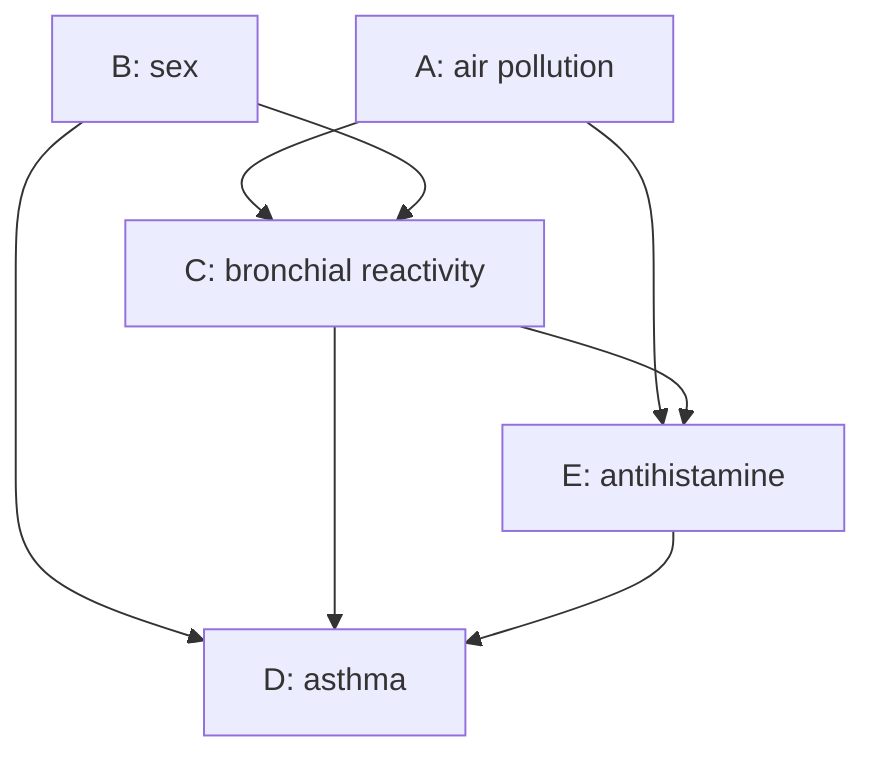
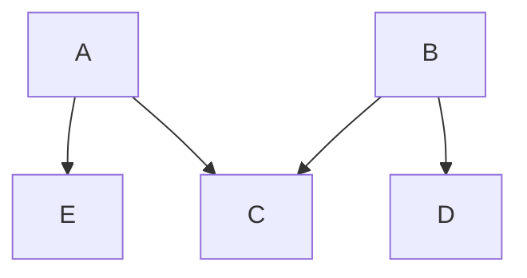

# 第十章：因果推断基础（潜在结果、识别、估计与因果图）

在前述统计学习章节中，我们更多关注变量之间的相关性（association）、预测能力与泛化误差。然而，在医学、公共政策、经济学、社会科学与推荐系统等问题中，研究者往往真正关心的是：如果主动改变某个处理、政策或暴露，结局变量会如何变化？这类问题不能仅靠条件相关或预测精度回答，而必须引入**干预（intervention）**、**反事实（counterfactual）**与**可识别性（identifiability）**的语言。

本章系统介绍现代因果推断的两条主线。第一条是 **Rubin 潜在结果框架**：用 $Y^1,Y^0$ 定义个体与总体因果效应，说明因果推断的根本缺失数据困难，并在一致性、正值性、随机化或条件交换性假设下推导 G-formula、IPTW、AIPW 与 G-估计等识别和估计公式。第二条是 **Pearl 因果图框架**：用 DAG 表达变量之间的直接因果关系，通过后门路径、碰撞点、d-separation 与 backdoor path criterion 判断哪些变量应当调整、哪些变量不应调整。两套语言最终服务于同一个目标：把不可直接观测的因果量转化为可由观测数据估计的统计泛函。

---

## 1. 潜在结果框架（Counterfactuals / Potential Outcomes）

因果推断的核心在于对比“若接受某种干预”与“若不接受某种干预”下个体结果的差异。

!!! info "定义 1.1 (潜在结果与可观测结果)"

    设二元干预变量为 $A \in \{0, 1\}$，其中 $A = 1$ 表示接受某种处理/干预（如服药），$A = 0$ 表示未接受干预（如服对照剂）。
    
    对于每一个个体，我们定义两个**潜在结果（Potential Outcomes）**：
    
    * $Y^1$：个体在接受干预（$A=1$）时将会出现的潜在结果。
    * $Y^0$：个体在不接受干预（$A=0$）时将会出现的潜在结果。
    
    在现实世界中，对于任一个体，我们只能观测到其中一种干预状态。现实中真实可观测的响应变量 $Y$ 与潜在结果之间满足如下**一致性（Consistency）**关系：
    
    \[
    Y = A Y^1 + (1 - A) Y^0
    \]

### 1.1 因果推断的根本问题（Fundamental Problem of Causal Inference）

由于因果效应的定义依赖于同一个体同时刻 $Y^1$ 与 $Y^0$ 的对比，而现实中 $Y^1$ 和 $Y^0$ 至少有一个是无法被观测到的反事实（Counterfactual）。因此，在**个体层面上，因果效应是永远无法直接观测和计算的**。

为了打破这一困境，统计学将视角从“个体因果效应”转向“群体平均因果效应”。

---

## 2. 因果效应的统计测度

在总体（Population）层面上，我们通过对潜在结果赋予期望算子，来定义可解的因果度量指标。

!!! info "定义 2.1 (平均因果效应 ATE 与条件平均因果效应 CATE)"

    * **平均因果效应（Average Causal Effect, ATE）**：定义为全总体中两种潜在结果期望的绝对差值：
    
    \[
    \text{ATE} = \mathbb{E}[Y^1 - Y^0] = \mathbb{E}[Y^1] - \mathbb{E}[Y^0]
    \]
    
    * **条件平均因果效应（Conditional Average Causal Effect, CATE）**：若存在一组多维协变量/混杂因素 $X \in \mathbb{R}^p$，在特定子群体 $X=x$ 内部的平均因果效应定义为：
    
    \[
    \text{CATE}(x) = \mathbb{E}[Y^1 - Y^0 \mid X = x]
    \]

### 2.1 相关性与因果性的本质区别

在观测数据（Observational Data）中，我们往往只能直接计算可观测的条件期望之差，即**相关性测度（Association Measure）**：

$$
\text{Association} = \mathbb{E}[Y \mid A = 1] - \mathbb{E}[Y \mid A = 0]
$$

一般情况下，$\mathbb{E}[Y \mid A = 1] - \mathbb{E}[Y \mid A = 0] \neq \mathbb{E}[Y^1] - \mathbb{E}[Y^0]$。

这是因为在观测数据中，由于混杂因素（Confounders）的存在，干预的分配 $A$ 往往与潜在结果 $(Y^1, Y^0)$ 本身不独立。例如，病情更严重的患者（其潜在健康的 $Y^0$ 较低）更有可能选择服药（$A=1$）。

---

## 3. 因果效应的可识别性（Identifiability）

为了能够将包含不可观测项的因果量（如 $\mathbb{E}[Y^1]$）转化为仅包含可观测样本数据的统计量，我们需要引入三条核心的可识别性假设。

!!! info "定义 3.1 (核心可识别性假设 三剑客)"

    1. **一致性（Consistency）**：如前文所述，真实观测值与对应的潜在结果严格一致，即当 $A=a$ 时，$Y = Y^a$。
    
    2. **正值性 / 满分配假设（Positivity / Overlap）**：在协变量 $X$ 的任意取值下，个体接受每种干预的概率都必须严格大于 0 且小于 1：
    
    \[
    0 < P(A = 1 \mid X = x) < 1, \quad \forall x
    \]
    
    3. **条件独立性 / 无忽略混杂假设（Conditional Exchangeability / Unconfoundedness）**：在控制了可观测的协变量 $X$ 之后，干预分配与潜在结果之间相互独立：
    
    \[
    (Y^1, Y^0) \perp \! \! \! \perp A \mid X
    \]

### 3.1 基于后置分层的因果识别定理

!!! note "定理 3.1 (因果识别定理 / 调整公式)"

    在满足一致性、正值性和条件独立性假设下，全总体的平均潜在结果期望 $\mathbb{E}[Y^a]$（$a \in \{0, 1\}$）可以被完全识别，且其关于可观测数据分布的计算公式为：
    
    \[
    \mathbb{E}[Y^a] = \mathbb{E}_X \left[ \mathbb{E}[Y \mid A = a, X] \right] = \int \mathbb{E}[Y \mid A = a, X = x] dF_X(x)
    \]

??? proof "证明：因果识别定理的数学推导"

    根据全期望公式（Law of Total Expectation），首先对潜在结果以协变量 $X$ 进行条件展开：
    
    \[
    \mathbb{E}[Y^a] = \mathbb{E}_X \left[ \mathbb{E}[Y^a \mid X] \right]
    \]
    
    接下来，利用第三条**条件独立性假设** $(Y^1, Y^0) \perp \! \! \! \perp A \mid X$，这意味着在给定 $X$ 的条件下，潜在结果 $Y^a$ 的期望与真实的干预状态 $A=a$ 是独立的。因此，我们可以将干预状态 $A=a$ 作为条件强行写入条件期望中：
    
    \[
    \mathbb{E}[Y^a \mid X] = \mathbb{E}[Y^a \mid A = a, X]
    \]
    
    随后，利用第一条**一致性假设**，当干预状态条件被限定为 $A=a$ 时，潜在结果 $Y^a$ 可以等价地替换为现实世界中的真实观测响应变量 $Y$：
    
    \[
    \mathbb{E}[Y^a \mid A = a, X] = \mathbb{E}[Y \mid A = a, X]
    \]
    
    将上述转化链代回最外层的全期望中，即得：
    
    \[
    \mathbb{E}[Y^a] = \mathbb{E}_X \left[ \mathbb{E}[Y \mid A = a, X] \right]
    \]
    
    即证。上式右端所有的概率分布与条件期望均可直接从观测到的数据集 $\mathcal{D}_n = \{(X_i, A_i, Y_i)\}_{i=1}^n$ 中估计得到。

---

## 4. 倾向性得分（Propensity Score）

当协变量 $X$ 的维度 $p$ 极高时，直接基于上述定理进行多维多元积分或非参数分层会遭遇严重的“维数灾难”。为了解决这一计算难题，模型引入了倾向性得分这一一维降维工具。

!!! info "定义 4.1 (倾向性得分 Propensity Score)"

    倾向性得分定义为在给定个体特征 $X$ 的条件下，该个体接受干预（$A=1$）的条件概率，记为 $e(X)$：
    
    \[
    e(X) = P(A = 1 \mid X)
    \]
    
    通常，倾向性得分可以通过对观测数据拟合一个逻辑回归（Logistic Regression）模型来隐式估计。

### 4.1 平衡得分性质（Balancing Score Property）

倾向性得分是一个非常神奇的降维泛函，它天然具有如下的“平衡性”特征。

!!! note "定理 4.1 (平衡得分定理)"

    给定倾向性得分 $e(X)$ 的条件下，原始多维特征 $X$ 与干预分配 $A$ 之间相互独立，即：
    
    \[
    X \perp \! \! \! \perp A \mid e(X)
    \]
    
    这意味着，在倾向性得分相同的子群体中，接受干预组与对照组的特征分布在统计学上是完全均衡的，达到了类似随机对照试验（RCT）的效果。

---

## 5. 逆概率加权法（Inverse Probability Treatment Weighting, IPTW）

逆概率加权法（IPTW）是利用倾向性得分去修正由于混杂因素导致的样本选择偏差（Selection Bias）的一种极其经典的非参数/半参数估计方法。其核心思想是通过赋予每个样本一个与其接受该干预的概率成反比的权重，从而创造出一个虚拟的“伪总体（Pseudo-population）”，在该伪总体中，混杂因素与干预变量之间不再具有相关性。

!!! note "定理 5.1 (IPTW 核心等价性定理)"

    若一致性、正值性与条件独立性假设成立，则平均潜在结果 $\mathbb{E}[Y^1]$ 和 $\mathbb{E}[Y^0]$ 可以通过如下逆概率加权的可观测期望公式进行精确计算：
    
    \[
    \mathbb{E}[Y^1] = \mathbb{E}\left[ \frac{A Y}{e(X)} \right]
    \]
    
    \[
    \mathbb{E}[Y^0] = \mathbb{E}\left[ \frac{(1 - A) Y}{1 - e(X)} \right]
    \]

??? proof "证明：IPTW 恒等式的严格数学推导"

    我们以证明干预组 $\mathbb{E}[Y^1]$ 为例。对右端的加权可观测期望算子，利用全期望公式按照特征 $X$ 进行展开：
    
    \[
    \mathbb{E}\left[ \frac{A Y}{e(X)} \right] = \mathbb{E}_X \left[ \mathbb{E}\left[ \frac{A Y}{e(X)} \;\middle|\; X \right] \right]
    \]
    
    由于分母 $e(X)$ 是关于 $X$ 的确定性函数，在内层关于 $X$ 的条件期望中，它可以作为常数因子提取到期望算子的外面：
    
    \[
    \mathbb{E}\left[ \frac{A Y}{e(X)} \;\middle|\; X \right] = \frac{1}{e(X)} \mathbb{E}[A Y \mid X]
    \]
    
    再次运用一致性假设，将内层项中的 $Y$ 展开为 $A Y^1 + (1 - A) Y^0$。注意到当有系数 $A$ 相乘时，$A(1-A) = 0$ 且 $A^2 = A$（因为 $A \in \{0, 1\}$）。因此：
    
    \[
    A Y = A (A Y^1 + (1 - A) Y^0) = A^2 Y^1 + A(1 - A) Y^0 = A Y^1
    \]
    
    将该结果代回条件期望中，得：
    
    \[
    \frac{1}{e(X)} \mathbb{E}[A Y \mid X] = \frac{1}{e(X)} \mathbb{E}[A Y^1 \mid X]
    \]
    
    现在，关键性地使用**条件独立性假设** $Y^1 \perp \! \! \! \perp A \mid X$。根据条件独立下乘积的期望等于期望的乘积这一数学性质，有：
    
    \[
    \mathbb{E}[A Y^1 \mid X] = \mathbb{E}[A \mid X] \cdot \mathbb{E}[Y^1 \mid X]
    \]
    
    根据倾向性得分的定义，$\mathbb{E}[A \mid X] = P(A = 1 \mid X) = e(X)$。将其代入式中：
    
    \[
    \frac{1}{e(X)} \mathbb{E}[A Y^1 \mid X] = \frac{1}{e(X)} \cdot e(X) \cdot \mathbb{E}[Y^1 \mid X] = \mathbb{E}[Y^1 \mid X]
    \]
    
    最后，将化简完的内层条件期望重新代回外层的关于 $X$ 的总体期望中：
    
    \[
    \mathbb{E}_X \left[ \mathbb{E}\left[ \frac{A Y}{e(X)} \;\middle|\; X \right] \right] = \mathbb{E}_X \left[ \mathbb{E}[Y^1 \mid X] \right] = \mathbb{E}[Y^1]
    \]
    
    即证毕。同理可严格推导对照组分量 $\mathbb{E}\left[ \frac{(1 - A) Y}{1 - e(X)} \right] = \mathbb{E}[Y^0]$。

通过这一恒等式，全总体的平均因果效应 ATE 可以在 IPTW 框架下统一写为：

$$
\text{ATE} = \mathbb{E}\left[ \frac{A Y}{e(X)} - \frac{(1 - A) Y}{1 - e(X)} \right]
$$

在实际样本计算中，我们常通过其对应的经验样本均值形式（Horvitz-Thompson 估计量）进行求解：

$$
\widehat{\text{ATE}}_{\text{IPTW}} = \frac{1}{n} \sum_{i=1}^n \frac{A_i Y_i}{\hat{e}(X_i)} - \frac{1}{n} \sum_{i=1}^n \frac{(1 - A_i) Y_i}{1 - \hat{e}(X_i)}
$$

## 6. IPTW 估计量的对偶表示（Dual Representation）

在实际中，我们还可以利用条件期望来理解和计算 IPTW。

!!! note "定理 6.1 (IPTW 的期望平滑性质)"

    设 $Y$ 为观测响应变量，$A$ 为二元干预变量，$e(X) = P(A=1 \mid X)$ 为倾向性得分。则 IPTW 算子中的两个部分分别满足如下对偶积分表示：
    
    \[
    \mathbb{E}\left[ \frac{A Y}{e(X)} \right] = \mathbb{E}\left[ \frac{A \cdot \mathbb{E}[Y \mid A=1, X]}{e(X)} \right]
    \]
    
    \[
    \mathbb{E}\left[ \frac{(1 - A) Y}{1 - e(X)} \right] = \mathbb{E}\left[ \frac{(1 - A) \cdot \mathbb{E}[Y \mid A=0, X]}{1 - e(X)} \right]
    \]

??? proof "证明：IPTW 对偶等式的数学推导"

    根据重叠期望定律（Law of Iterated Expectations），对算子内部进行关于 $X$ 的条件展开：
    
    \[
    \mathbb{E}\left[ \frac{A Y}{e(X)} \right] = \mathbb{E}_X \left[ \mathbb{E}\left[ \frac{A Y}{e(X)} \;\middle|\; X \right] \right] = \mathbb{E}_X \left[ \frac{1}{e(X)} \mathbb{E}[A Y \mid X] \right]
    \]
    
    利用全期望公式进一步分解内层项 $\mathbb{E}[A Y \mid X]$，对干预变量 $A \in \{0, 1\}$ 的取值进行离散求和展开：
    
    \[
    \mathbb{E}[A Y \mid X] = P(A=1 \mid X) \cdot \mathbb{E}[A Y \mid A=1, X] + P(A=0 \mid X) \cdot \mathbb{E}[A Y \mid A=0, X]
    \]
    
    由于当 $A=1$ 时 $A Y = Y$，而当 $A=0$ 时 $A Y = 0$，因此上式第二项完全消除。代入倾向性得分 $P(A=1 \mid X) = e(X)$ 得到：
    
    \[
    \mathbb{E}[A Y \mid X] = e(X) \cdot \mathbb{E}[Y \mid A=1, X] + 0 = e(X) \cdot \mathbb{E}[Y \mid A=1, X]
    \]
    
    现在，我们将这个结果以另一种形式反向构造。注意到 $A$ 只能取 0 或 1，如果我们在期望内部用 $\mathbb{E}[Y \mid A=1, X]$ 这一条件期望函数（它是关于 $X$ 的确定性函数）去替换原本的随机变量 $Y$，我们可以重新计算：
    
    \[
    \mathbb{E}[A \cdot \mathbb{E}[Y \mid A=1, X] \mid X] = \mathbb{E}[Y \mid A=1, X] \cdot \mathbb{E}[A \mid X] = \mathbb{E}[Y \mid A=1, X] \cdot e(X)
    \]
    
    由于两侧在给定 $X$ 后的条件期望结果完全相等，即：
    
    \[
    \mathbb{E}[A Y \mid X] = \mathbb{E}[A \cdot \mathbb{E}[Y \mid A=1, X] \mid X]
    \]
    
    将该恒等式代回最外层的 $\mathbb{E}_X$ 中，即可证得：
    
    \[
    \mathbb{E}\left[ \frac{A Y}{e(X)} \right] = \mathbb{E}\left[ \frac{A \cdot \mathbb{E}[Y \mid A=1, X]}{e(X)} \right]
    \]

---

## 7. 标准化法（Standardization / G-Formula）

标准化法（又称条件回归外推法）是另一种识别 ATE 的基本方法。其直接对响应变量的回归表面 $m(a, x) = \mathbb{E}[Y \mid A=a, X=x]$ 进行建模。

!!! info "定义 7.1 (标准化估计量)"

    通过拟合观测回归模型 $\hat{m}(a, x)$，全总体平均因果效应的标准化估计量为：
    
    \[
    \widehat{\text{ATE}}_{\text{Std}} = \frac{1}{n} \sum_{i=1}^n \hat{m}(1, X_i) - \frac{1}{n} \sum_{i=1}^n \hat{m}(0, X_i)
    \]

* **IPTW 与 Standardization 的哲学对比**：
  * IPTW 专注于干预分配模型（Exposure Model / Propensity Score），试图使两组的特征分布重新平衡。
  * 标准化法专注于结果响应模型（Outcome Model），通过对反事实进行直接的条件期望外推来求解。

---

## 8. 边际结构模型（Marginal Structural Models, MSM）

当我们需要分析连续型干预、多时点动态干预，或者想要对潜在结果施加参数化回归形式时，普通的 IPTW 无法直接使用。为此，我们引入边际结构模型（MSM）。

!!! info "定义 8.1 (边际结构模型)"

    边际结构模型是直接建立在**潜在结果的边际期望**上的模型。例如，对于二元或连续干预 $A$，一个经典的线性 MSM 形式为：
    
    \[
    \mathbb{E}[Y^a] = \beta_0 + \beta_1 a
    \]
    
    这里的参数 $\beta_1$ 具有极其纯粹的因果含义：$\beta_1 = \mathbb{E}[Y^1] - \mathbb{E}[Y^0] = \text{ATE}$。

### 8.1 基于伪总体的加权最小二乘求解

在现实观测数据中，由于混杂因素的存在，若直接对真实观测值拟合 $Y = \beta_0 + \beta_1 A + \epsilon$，得到的 $\beta_1$ 将带有偏置。MSM 通过求解如下**加权最小二乘（Weighted Least Squares, WLS）**问题来实现无偏估计：

$$
\min_{\beta_0, \beta_1} \sum_{i=1}^n W_i \left( Y_i - \beta_0 - \beta_1 A_i \right)^2
$$

其中样本权重系数通常采用**稳定权重（Stabilized Weights）**：

$$
W_i = \frac{P(A = A_i)}{\hat{e}(X_i)^{A_i} (1 - \hat{e}(X_i))^{1 - A_i}}
$$

---

## 9. 双重稳健估计（Doubly Robust Estimation）

为了结合倾向性得分模型与结果响应模型的各自优势，统计学家设计了双重稳健估计量（DR Estimator）。该估计量的最大特点是：只要倾向性得分模型与结果回归模型中**至少有一个是正确的**，因果效应的估计就是无偏的。

!!! info "定义 9.1 (双重稳健估计量表达式)"

    定义潜在结果 $\mathbb{E}[Y^1]$ 的双重稳健估计算子如下：
    
    \[
    \hat{\mu}_{\text{DR}}^1 = \frac{1}{n} \sum_{i=1}^n \left[ \frac{A_i Y_i}{\hat{e}(X_i)} - \frac{A_i - \hat{e}(X_i)}{\hat{e}(X_i)} \hat{m}(1, X_i) \right]
    \]

!!! note "定理 9.1 (双重稳健性定理)"

    若一致性、正值性与条件独立性成立，且当倾向性得分模型 $e(X)$ 设定正确 或 结果回归模型 $m(1, X)$ 设定正确时，$\hat{\mu}_{\text{DR}}^1$ 渐近无偏，即 $\mathbb{E}[\hat{\mu}_{\text{DR}}^1] = \mathbb{E}[Y^1]$。

??? proof "证明：双重稳健估计量的双模型鲁棒性证明"

    我们将 DR 算子重写为如下更加直观的代数格式：
    
    \[
    \hat{\mu}_{\text{DR}}^1 = \frac{1}{n} \sum_{i=1}^n \left[ \hat{m}(1, X_i) + \frac{A_i (Y_i - \hat{m}(1, X_i))}{\hat{e}(X_i)} \right]
    \]
    
    下面我们分两种最坏的情景分别论证其期望收敛到 $\mathbb{E}[Y^1]$：
    
    **情况 1：结果回归模型 $\hat{m}$ 设定完全正确，但倾向得分模型 $\hat{e}$ 设定错误。**
    
    此时，由于 $\hat{m}(1, X) = \mathbb{E}[Y \mid A=1, X]$ 完美成立。根据重叠期望定律，我们对其第二项算子关于 $(A, X)$ 求条件期望：
    
    \[
    \mathbb{E}\left[ \frac{A (Y - \hat{m}(1, X))}{\hat{e}(X)} \;\middle|\; A, X \right] = \frac{A}{\hat{e}(X)} \mathbb{E}[Y - \hat{m}(1, X) \mid A, X]
    \]
    
    当干预变量 $A=1$ 时：
    
    \[
    \mathbb{E}[Y - \hat{m}(1, X) \mid A=1, X] = \mathbb{E}[Y \mid A=1, X] - \hat{m}(1, X) = 0
    \]
    
    当干预变量 $A=0$ 时，分子上的 $A=0$ 直接使得整项变为 0。
    
    因此，无论错误的 $\hat{e}(X)$ 取何值，第二项的期望值都恒为 0。整个式子的总体期望退化为：
    
    \[
    \mathbb{E}[\hat{\mu}_{\text{DR}}^1] = \mathbb{E}_X [\hat{m}(1, X)] + 0 = \mathbb{E}_X [ \mathbb{E}[Y^1 \mid X] ] = \mathbb{E}[Y^1]
    \]
    
    **情况 2：倾向得分模型 $\hat{e}$ 设定完全正确，但结果回归模型 $\hat{m}$ 设定错误。**
    
    此时 $\hat{e}(X) = e(X) = P(A=1 \mid X)$。我们将原展开式按照真实期望展开：
    
    \[
    \mathbb{E}[\hat{\mu}_{\text{DR}}^1] = \mathbb{E}\left[ \hat{m}(1, X) \right] + \mathbb{E}\left[ \frac{A Y}{e(X)} \right] - \mathbb{E}\left[ \frac{A \hat{m}(1, X)}{e(X)} \right]
    \]
    
    根据前文第 6 节中推导出的 **IPTW 对偶表示定理**，最后一项可以平滑转化为：
    
    \[
    \mathbb{E}\left[ \frac{A \hat{m}(1, X)}{e(X)} \right] = \mathbb{E}_X \left[ \frac{\mathbb{E}[A \mid X] \hat{m}(1, X)}{e(X)} \right] = \mathbb{E}_X \left[ \frac{e(X) \hat{m}(1, X)}{e(X)} \right] = \mathbb{E}\left[ \hat{m}(1, X) \right]
    \]
    
    代回式中，我们可以发现第一项 $\mathbb{E}\left[ \hat{m}(1, X) \right]$ 与 third 项完全正负抵消：
    
    \[
    \mathbb{E}[\hat{\mu}_{\text{DR}}^1] = \mathbb{E}\left[ \hat{m}(1, X) \right] + \mathbb{E}\left[ \frac{A Y}{e(X)} \right] - \mathbb{E}\left[ \hat{m}(1, X) \right] = \mathbb{E}\left[ \frac{A Y}{e(X)} \right]
    \]
    
    由于倾向性得分模型正确，利用 IPTW 识别定理，该项严格等于 $\mathbb{E}[Y^1]$。
    
    综合两种情况，即证双重稳健性。

---

## 10. G-估计（G-estimation of Structural Nested Models）

G-估计是针对结构嵌套模型（Structural Nested Models, SNM）的一种更高级的半参数因果推断技术，其核心思想是寻找使反事实结果与干预分配不相关的因果效应参数。

!!! info "定义 10.1 (结构嵌套模型基本设定)"

    考虑条件平均因果效应 CATE 具有如下参数化嵌套形式：
    
    \[
    \mathbb{E}[Y^1 - Y^0 \mid A=1, X] = \psi \cdot X
    \]
    
    这意味着参数 $\psi$ 捕捉了协变量 $X$ 对因果效应的调节作用（交互效应）。

### 10.1 零因果关系估计方程（Estimating Equation）

为了解出未知因果参数 $\psi$，根据条件独立性假设，$Y^0 \perp \! \! \! \perp A \mid X$。这意味着反事实零状态结果 $Y^0$ 在控制 $X$ 后不应该对干预分配 $A$ 具有任何预测能力。

我们可以为每个体构造其对应的反事实结果估计值：

$$
H_i(\psi) = Y_i - A_i \cdot (\psi \cdot X_i)
$$

根据无忽略混杂假设，当 $\psi$ 取得真实值时，下述无相关性估计方程必须成立：

$$
\mathbb{E}\left[ (A - e(X)) \cdot H(\psi) \;\middle|\; X \right] = 0
$$

通过在样本数据上建立对应的经验样本方程并令其等于 0：

$$
\frac{1}{n} \sum_{i=1}^n (A_i - \hat{e}(X_i)) \cdot \left( Y_i - A_i \psi X_i \right) = 0
$$

由此可直接通过解析闭式解（或拟合广义估计方程 GEE）精确反解出因果核心参数 $\psi$ 的无偏估计值。
---

## 11. 因果图（Causal Diagrams）

前面 1--10 节主要采用潜在结果框架来定义因果量、说明识别假设，并给出标准化、IPTW、双重稳健估计与 G-估计等估计方法。从本节开始，我们引入另一套同样重要的语言：**因果图（causal diagrams）**。因果图的作用不是替代潜在结果，而是用图结构清晰表达变量之间的直接因果关系、混杂路径、碰撞点结构以及应当调整的协变量集合。

!!! info "本章后半部分的主线"

    因果图部分的核心问题是：
    
    1. 如何用有向图表达研究者关于因果结构的科学假设；
    2. 如何从图中读出变量之间的统计独立性与条件独立性；
    3. 如何判断暴露变量与结局变量之间是否存在混杂；
    4. 如何用 **d-separation** 和 **backdoor path criterion** 找到足以控制混杂的调整集合。

### 11.1 抗组胺药与哮喘的例子

考虑一个关于小学一年级儿童中**抗组胺药使用**与**哮喘发生**之间关系的假想研究。定义变量：

air pollution level 记为 $A$，sex 记为 $B$，bronchial reactivity 记为 $C$，asthma 记为 $D$，antihistamine use 记为 $E$。我们假设研究者掌握如下背景知识：

1. 空气污染水平 $A$ 与性别 $B$ 独立；
2. 性别 $B$ 对抗组胺药使用 $E$ 的影响只通过支气管反应性 $C$ 实现，但 $B$ 会直接影响哮喘风险 $D$；
3. 工业空气污染 $A$ 只会通过抗组胺药使用 $E$ 与支气管反应性 $C$ 导致哮喘发作，不存在 $A \to D$ 的直接效应；
4. 除了性别 $B$、支气管反应性 $C$ 与空气污染 $A$ 之外，没有其他重要混杂因素。

上述假设可以用如下有向图表达：

!!! info "定义 11.1（图中的基本对象）"

    在一个因果图中：
    
    * 表示变量的点称为**顶点（vertices）**或**节点（nodes）**；
    * 连接两个变量的线或箭头称为**边（edges）**或**弧（arcs）**；
    * 箭头 $X \to Y$ 表示从原因到结果的一个**直接因果连接（direct causal link）**，也就是说，$X$ 对 $Y$ 的这部分影响不通过图中的其他变量中介。

例如，$A \to C$ 表示空气污染 $A$ 对支气管反应性 $C$ 有直接因果效应；$A$ 与 $D$ 之间没有箭头，表达的是“不存在 $A \to D$ 的直接因果效应”，即污染水平对哮喘的影响要通过 $C$ 或 $E$ 等中间变量发生。

### 11.2 路径、祖先、父节点与子节点

!!! info "定义 11.2（路径与截断）"

    一个由若干条边连接起来的节点序列称为一条**路径（path）**。如果路径中的某个中间节点位于这条路径上，则称该节点**截断（intercept）**这条路径。
    
    例如，$C$ 截断路径
    
    \[
    A - C - D
    \]
    
    以及路径
    
    \[
    E - C - D.
    \]

!!! info "定义 11.3（祖先、后代、父节点与子节点）"

    若从 $X$ 出发存在一条有向路径指向 $Y$，则称 $X$ 是 $Y$ 的**祖先（ancestor）**或原因，称 $Y$ 是 $X$ 的**后代（descendant）**。
    
    若存在一条单箭头边
    
    \[
    X \to Y,
    \]
    
    则称 $X$ 是 $Y$ 的**父节点（parent）**，称 $Y$ 是 $X$ 的**子节点（child）**。

在上面的哮喘 DAG 中，$A,B,C$ 都是 $E,D$ 的祖先；$E,D$ 是 $A,B,C$ 的后代。$A$ 与 $C$ 是 $E$ 的父节点，$E$ 是 $A$ 与 $C$ 的子节点。$C$ 与 $E$ 是 $D$ 的父节点，$D$ 是 $C$ 与 $E$ 的子节点。

### 11.3 后门路径、碰撞点与阻断路径

!!! info "定义 11.4（后门路径 Backdoor Path）"

    连接 $X$ 与 $Y$ 的一条路径如果在 $X$ 端有箭头指向 $X$，则称为从 $X$ 到 $Y$ 的一条**后门路径（backdoor path）**。
    
    换言之，若我们关心 $X$ 对 $Y$ 的因果效应，那么以
    
    \[
    X \leftarrow \cdots \cdots Y
    \]
    
    形式开始的路径就是后门路径。它不是从 $X$ 发出的因果路径，而是可能反映了 $X$ 与 $Y$ 的共同原因，从而带来混杂。

在上述图中，如果关心抗组胺药 $E$ 对哮喘 $D$ 的因果效应，除直接路径

$$
E \to D
$$

之外，从 $E$ 到 $D$ 的其他路径都属于后门路径，例如：

$$
E \leftarrow A \to C \to D,
$$

$$
E \leftarrow C \to D,
$$

$$
E \leftarrow C \leftarrow B \to D,
$$

以及

$$
E \leftarrow A \to C \leftarrow B \to D.
$$

!!! info "定义 11.5（碰撞点 Collider）"

    若一条路径进入某个节点 $X$ 时带有箭头头部，离开该节点时也带有箭头头部，即局部结构形如
    
    \[
    U \to X \leftarrow V,
    \]
    
    则称这条路径在 $X$ 处**碰撞（collide）**，并称 $X$ 是这条路径上的**碰撞点（collider）**。

!!! info "定义 11.6（阻断与非阻断路径）"

    在不调整任何变量时，如果一条路径上含有至少一个碰撞点，则这条路径称为**被阻断（blocked）**；如果路径上不含碰撞点，则称为**非阻断（unblocked）**。

在哮喘 DAG 中：

* 后门路径

  $E \leftarrow A \to C \leftarrow B \to D$

  在 $C$ 处形成碰撞结构 $A \to C \leftarrow B$，因此该路径被 $C$ 阻断；

* 后门路径

  $E \leftarrow A \to C \to D$

  不包含碰撞点，因此是非阻断路径；

* 后门路径

  $E \leftarrow C \to D$

  不包含碰撞点，因此也是非阻断路径。

---

## 12. 有向无环图（Directed Acyclic Graph, DAG）

### 12.1 DAG 的定义

!!! info "定义 12.1（有向无环图 DAG）"

    一个图称为**有向无环图（Directed Acyclic Graph, DAG）**，如果它满足：
    
    1. **Directed**：所有边都是有方向的箭头；
    2. **Acyclic**：不存在任何由有向路径构成的闭合环路。
    
    在因果语境下，一条有向路径
    
    \[
    X \to \cdots \to Y
    \]
    
    表示从 $X$ 到 $Y$ 的因果路径。

!!! info "定义 12.2（因果 DAG）"

    一个 DAG 称为**因果 DAG（causal DAG）**，如果图中任意一对变量的所有共同原因都已经包含在图中。
    
    注意：研究者不需要把所有现实世界变量都放入 DAG 中；只需要包含与研究问题有关的变量，以及变量对之间的重要共同原因。

### 12.2 DAG 的非参数性与因果含义

DAG 本身是**非参数的（nonparametric）**。它不规定变量之间的函数形式，也不假设线性模型、正态性或方差齐性。它只编码如下结构性信息：

1. 哪些变量之间存在直接因果连接；
2. 哪些变量之间不存在直接因果连接；
3. 哪些路径可能产生统计关联；
4. 哪些路径可能产生混杂。

!!! note "命题 12.1（有向路径与因果效应）"

    若图中不存在从 $X$ 到 $Y$ 的有向路径，则在该因果 DAG 所表达的结构假设下，$X$ 对 $Y$ 不存在因果效应。
    
    例如，如果 $A$ 与 $B$ 之间不存在任何从 $A$ 到 $B$ 的有向路径，则 $A$ 对 $B$ 没有因果效应。进一步地，如果不存在路径 $A \to \cdots \to B \to \cdots \to D$，那么 $A$ 也不可能通过 $B$ 对 $D$ 产生因果效应。

### 12.3 DAG 编码的统计独立性

图不仅表达因果结构，也会编码变量之间的统计独立性。直观地说：如果两个变量之间没有非阻断路径，那么它们在统计上应该独立。

在哮喘 DAG 中，$A$ 与 $B$ 没有边相连，且它们之间的路径

$$
A \to C \leftarrow B
$$

在 $C$ 处是碰撞点，所以边际上被阻断。因此 DAG 表达了

$$
A \perp\!\!\!\perp B.
$$

!!! success "命题 12.2（变量统计相关的两个主要来源）"

    在因果 DAG 中，两个变量产生统计依赖通常只有两个原因：
    
    1. 二者共享共同原因，即存在混杂路径；
    2. 一个变量是另一个变量的原因，或二者之间存在有向因果路径。

### 12.4 Markov 分解公式

DAG 最重要的数学内容之一是它给出了联合分布的分解方式。设 $pa(V)$ 表示节点 $V$ 的父节点集合。在一个 DAG 上，联合密度可以分解为每个节点在其父节点条件下的条件密度乘积。

!!! success "定理 12.1（DAG 的 Markov 分解）"

    设变量集合为 $V_1,\dots,V_p$，其因果结构由一个 DAG $G$ 描述。若联合分布服从该 DAG 的 Markov 性，则有：
    
    \[
    f(v_1,\dots,v_p)=\prod_{j=1}^p f\bigl(v_j\mid pa(v_j)\bigr).
    \]

对于哮喘例子，父节点集合为

$$
pa(A)=\varnothing,\quad pa(B)=\varnothing,
$$

$$
pa(C)=\{A,B\},\quad pa(E)=\{A,C\},\quad pa(D)=\{B,C,E\}.
$$

因此联合密度分解为

$$
\begin{aligned}
f(A,E,C,B,D)
&= f(D\mid B,C,E) f(C\mid A,B) f(E\mid A,C) f(A) f(B) \\
&= f(D\mid pa(D)) f(C\mid pa(C)) f(E\mid pa(E)) f(A\mid pa(A)) f(B\mid pa(B)).
\end{aligned}
$$

??? proof "证明：哮喘 DAG 的 Markov 分解"

    对任意五个变量，概率链式法则给出
    
    \[
    f(A,E,C,B,D)
    = f(D\mid A,E,C,B) f(E\mid A,C,B) f(C\mid A,B) f(A\mid B) f(B).
    \]
    
    DAG 的局部 Markov 性说明：每个节点在给定其父节点后，与其非后代变量条件独立。
    
    对 $D$ 而言，其父节点为 $B,C,E$。给定 $B,C,E$ 后，$D$ 不再需要额外条件 $A$：
    
    \[
    f(D\mid A,E,C,B)=f(D\mid B,C,E).
    \]
    
    对 $E$ 而言，其父节点为 $A,C$。给定 $A,C$ 后，$E$ 与 $B$ 条件独立：
    
    \[
    f(E\mid A,C,B)=f(E\mid A,C).
    \]
    
    对 $A$ 与 $B$ 而言，二者均没有父节点，并且边际独立，因此
    
    \[
    f(A\mid B)=f(A).
    \]
    
    代回链式分解可得
    
    \[
    f(A,E,C,B,D)
    = f(D\mid B,C,E) f(E\mid A,C) f(C\mid A,B) f(A) f(B).
    \]
    
    即证。 $\square$

### 12.5 DAG 中的两类非阻断路径

在一个 DAG 中，两个变量之间的非阻断路径主要有两种：

1. **有向路径（directed path）**：例如

   $E \to D.$

   这种路径表示关联至少部分来自因果效应；结果变量是原因变量的后代。

2. **通过共同祖先形成的后门路径（backdoor path through a shared ancestor）**：例如

   $E \leftarrow C \to D.$

   这种路径表示关联至少部分来自混杂。

当然，二者可以同时存在。例如在哮喘 DAG 中，$E$ 与 $D$ 之间既有直接因果路径

$$
E \to D,
$$

也有若干后门路径，如

$$
E \leftarrow C \to D,
\quad
E \leftarrow A \to C \to D,
\quad
E \leftarrow C \leftarrow B \to D.
$$

### 12.6 阻断路径与边际关联的关系

需要特别注意：一条非阻断路径的存在只表示两个变量**可以相关**，但不保证它们一定相关。多个路径的作用可能相互抵消。例如，$E$ 与 $D$ 之间的三条后门路径和直接路径可能在数值上抵消，从而导致边际上观察不到 $E$ 与 $D$ 的关联。

另一方面，被阻断路径的存在与否不应影响变量之间的边际关联。特别是对于碰撞点结构

$$
A \to C \leftarrow B,
$$

$A$ 与 $B$ 作为同一结果 $C$ 的两个原因，其边际关联在 $C$ 发生之前已经确定，不应由其共同结果 $C$ 的后果改变。

---

## 13. DAG 与混杂（DAGs and Confounding）

### 13.1 混杂的图论定义

!!! info "定义 13.1（混杂 Confounding）"

    当研究暴露组与对照组在结局变量的概率分布上存在差异，而这种差异并非由暴露本身的因果效应造成时，就称存在**混杂（confounding）**。
    
    这种非因果差异通常来自外部变量的影响，这些外部变量称为**混杂变量（confounders）**。

更图论化地说：若即使移除、阻止或屏蔽所有暴露变量对结局变量的因果效应后，暴露变量与结局变量仍然相关，则说明存在混杂。

### 13.2 在 DAG 中检查混杂的算法

假设我们关心暴露 $E$ 对疾病或结局 $D$ 的因果效应。判断是否存在混杂可以使用如下图算法。

!!! success "算法 13.1（DAG 中混杂的检查）"

    1. 删除所有从暴露变量 $E$ 发出的箭头，即删除所有暴露效应；
    2. 在新的图中，检查从 $E$ 到 $D$ 是否仍然存在非阻断路径。
    
    若删除暴露效应后，$E$ 与 $D$ 之间仍有非阻断路径，则说明在零因果效应假设下，$E$ 与 $D$ 仍会相关，因此存在混杂。

该算法的统计含义是：在没有 $E \to D$ 因果效应的世界里，$E$ 与 $D$ 是否还会由于共同原因而相关？如果会，则这种相关性就是混杂。

需要注意，疾病 $D$ 的后果在该算法中不起关键作用。因为任何从 $E$ 到 $D$、再通过 $D$ 的后代返回的路径，都必须经过碰撞点，因此通常会被阻断。

### 13.3 哮喘 DAG 中的潜在混杂变量

对于哮喘 DAG，若研究 $E$ 对 $D$ 的效应，删除 $E \to D$ 后，仍存在多条从 $E$ 到 $D$ 的非阻断后门路径：

$$
E \leftarrow C \to D,
$$

$$
E \leftarrow A \to C \to D,
$$

$$
E \leftarrow C \leftarrow B \to D.
$$

因此，$A,C,B$ 都是潜在混杂变量。自然的问题是：是否只要调整所有看起来像混杂变量的变量，就一定能控制混杂？答案是否定的，因为对碰撞点的调整可能反而打开原本被阻断的路径。

### 13.4 条件化调整的陷阱：只调整 $C$ 为什么不够？

一种传统思路是：只要对潜在混杂变量进行条件化即可。对哮喘 DAG 来说：

* 若只调整 $A$，路径 $E \leftarrow A \to C \to D$ 被阻断，但 $E \leftarrow C \to D$ 与 $E \leftarrow C \leftarrow B \to D$ 仍然非阻断；

* 若只调整 $B$，路径 $E \leftarrow C \leftarrow B \to D$ 被阻断，但 $E \leftarrow C \to D$ 与 $E \leftarrow A \to C \to D$ 仍然非阻断；

* 若只调整 $C$，看起来似乎能阻断

  $
  E \leftarrow A \to C \to D,
  \quad
  E \leftarrow C \leftarrow B \to D,
  \quad
  E \leftarrow C \to D.$

但问题在于：$C$ 同时也是 $A$ 与 $B$ 的共同结果，即存在碰撞结构

$$
A \to C \leftarrow B.
$$

对碰撞点 $C$ 条件化会在 $A$ 与 $B$ 之间诱导关联，从而打开原本被阻断的路径

$$
E \leftarrow A \to C \leftarrow B \to D.
$$

更直观地说，调整 $C$ 后，$A$ 与 $B$ 在 $C$ 的层内不再独立，而 $B$ 又直接影响 $D$，于是形成了从 $E$ 到 $D$ 的新后门路径。

### 13.5 数值例子：条件化碰撞点会诱导关联

考虑如下三维列联表。行表示 $C$ 的取值，列按 $A$ 与 $B$ 分组：

|       | $A=1,B=1$ | $A=1,B=0$ | $A=0,B=1$ | $A=0,B=0$ |
| ----- | --------: | --------: | --------: | --------: |
| $C=1$ |       800 |       600 |       400 |       200 |
| $C=0$ |       200 |       400 |       600 |       800 |
| Total |      1000 |      1000 |      1000 |      1000 |

由总计数可得

$$
\Pr(A=1\mid B)=\Pr(A=1)=\Pr(B=1\mid A)=\Pr(B=1)=0.5.
$$

因此 $A$ 与 $B$ 边际独立。进一步，

$$
\Pr(C=1\mid A=1,B)-\Pr(C=1\mid A=0,B)=0.4,
$$

并且

$$
\Pr(C=1\mid A,B=1)-\Pr(C=1\mid A,B=0)=0.2.
$$

这与局部结构

$$
A \to C \leftarrow B
$$

一致：$A$ 与 $B$ 都会影响 $C$。

但是，在 $C$ 的层内，$A$ 与 $B$ 不再独立。以条件优势比为例：

当 $C=1$ 时，

$$
OR_{AB\mid C=1}
=\frac{800\times 200}{600\times 400}
=\frac{2}{3}\neq 1.
$$

当 $C=0$ 时，

$$
OR_{AB\mid C=0}
=\frac{200\times 800}{400\times 600}
=\frac{2}{3}\neq 1.
$$

这说明虽然边际上 $A \perp\!\!\!\perp B$，但在给定 $C$ 后，一般有

$$
A \not\perp\!\!\!\perp B\mid C.
$$

!!! warning "碰撞点调整规则"

    如果 $C$ 是 $A$ 与 $B$ 的共同结果，即
    
    \[
    A \to C \leftarrow B,
    \]
    
    那么 $A$ 与 $B$ 在给定 $C$ 的层内的关联通常会不同于二者的边际关联。特别地，即使 $A$ 与 $B$ 边际独立，条件化 $C$ 也可能诱导 $A$ 与 $B$ 的条件相关。

### 13.6 回到原 DAG：应该调整什么？

回到哮喘 DAG，对 $C$ 条件化可能打开路径

$$
E \leftarrow A \to C \leftarrow B \to D.
$$

因此，**仅仅调整 $A$、仅仅调整 $B$ 或仅仅调整 $C$ 都不足以控制混杂**。

然而，如果调整 $A$ 与 $C$，则：

* $C$ 阻断 $E \leftarrow C \to D$；
* $C$ 阻断 $E \leftarrow C \leftarrow B \to D$；
* $A$ 阻断由调整 $C$ 打开的 $E \leftarrow A \to C \leftarrow B \to D$。

因此

$$
S=\{A,C\}
$$

是一个充分调整集合。

同理，如果调整 $B$ 与 $C$，则 $B$ 会阻断由调整 $C$ 打开的通过 $B$ 的路径，因此

$$
S=\{B,C\}
$$

也是一个充分调整集合。

### 13.7 另一个反例：不该调整碰撞点

考虑如下 DAG：

如果研究 $E$ 对 $D$ 的效应，唯一的后门路径是

$$
E \leftarrow A \to C \leftarrow B \to D.
$$

该路径在 $C$ 处是碰撞点，所以在不调整 $C$ 时是阻断的。因此该 DAG 下不存在混杂。

但是，传统经验可能会认为：$C$ 与 $E$ 相关，且 $C$ 在给定 $E$ 后也与 $D$ 相关，于是把 $C$ 当成潜在混杂变量来调整。这样做反而会打开碰撞点路径

$$
E \leftarrow A \to C \leftarrow B \to D,
$$

使 $E$ 与 $D$ 之间出现人为诱导的非因果关联。

!!! danger "重要结论"

    不是所有与暴露和结局都相关的变量都应该调整。若一个变量是碰撞点或碰撞点的后代，对其条件化可能引入选择偏差或碰撞偏差（collider bias）。

---

## 14. d-分离（d-separation）

前面关于“路径是否被阻断”的讨论可以统一为一个图论概念：**d-separation**。它是从 DAG 读出条件独立性的核心规则。

### 14.1 trail 的 d-分离定义

!!! info "定义 14.1（trail 被集合阻断 / d-separated）"

    设 $G$ 是一个 DAG。若 $A$ 与 $Y$ 之间的一条 trail 被一个与 $\{A,Y\}$ 不相交的节点集合 $B$ 阻断，则称这条 trail 被 $B$ **d-separated** 或 **blocked**。
    
    具体地，若满足以下任一条件，则该 trail 被 $B$ 阻断：
    
    1. 该 trail 含有一个碰撞点 $C$，且 $C$ 及其任意后代都不在 $B$ 中；
    2. 该 trail 含有一个 chain 或 fork 结构，并且其中的中间节点属于 $B$。

这里的三种基本局部结构为：

1. chain：

   $
   X \to Z \to Y
   \quad\text{或}\quad
   X \leftarrow Z \leftarrow Y;
   $

2. fork：

   $
   X \leftarrow Z \to Y;
   $

3. collider：

   $
   X \to Z \leftarrow Y.
   $

其中，对 chain 或 fork 的中间节点 $Z$ 条件化会阻断路径；对 collider $Z$ 或其后代条件化则会打开路径。

!!! info "定义 14.2（两个节点被集合 d-separated）"

    若 $A$ 与 $Y$ 之间的所有 trail 都被节点集合 $B$ d-separated，则称节点 $A$ 与节点 $Y$ 被 $B$ 在 DAG $G$ 中 d-separated 或 blocked。
    
    记号上可写作
    
    \[
    (A \perp\!\!\!\perp Y\mid B)_G.
    \]
    
    这个记号表示的是**图上的 d-分离关系**，不要与概率论中的条件独立
    
    \[
    A \perp\!\!\!\perp Y\mid B
    \]
    
    混淆。前者是图论性质，后者是分布性质。若分布满足 DAG 的 Markov 性，则图上的 d-分离通常蕴含分布中的条件独立。

### 14.2 变量集合之间的 d-分离

!!! info "定义 14.3（变量集合之间的 d-separation）"

    若 $A$ 和 $Y$ 中至少一个是节点集合，并且 $A,Y,B$ 两两不交，则称集合 $A$ 与集合 $Y$ 被集合 $B$ d-separated，当且仅当 $B$ 在 $G$ 中 d-separates $A$ 中每一个节点与 $Y$ 中每一个节点。

因此，$B$ d-separates 两组变量 $A$ 与 $Y$，可以理解为同时满足：

1. 每条从 $A$ 到 $Y$ 的原始非阻断路径都被 $B$ 中某个变量截断；
2. 每条由于调整 $B$ 中变量而新打开的路径，也被 $B$ 中其他变量截断。

若两个节点或变量集合没有被 d-separated，则称它们是 **d-connected** 或 **unblocked**。

### 14.3 d-separation 与条件独立的关系

!!! success "定理 14.1（全局 Markov 性）"

    若联合分布 $P$ 对 DAG $G$ 满足 Markov 性，并且节点集合 $A$ 与 $Y$ 被 $B$ d-separated，即
    
    \[
    (A \perp\!\!\!\perp Y\mid B)_G,
    \]
    
    则在分布 $P$ 下有条件独立关系
    
    \[
    A \perp\!\!\!\perp Y\mid B.
    \]

??? proof "证明思路：为什么 d-separation 蕴含条件独立"

    DAG 的 Markov 分解说明联合密度可以写成
    
    \[
    f(v_1,\dots,v_p)=\prod_{j=1}^p f(v_j\mid pa(v_j)).
    \]
    
    这个分解使得每个节点在给定父节点后与非后代节点条件独立。d-separation 的三条局部规则正是对如下三类基本分解的推广：
    
    **1. Chain 结构** $X\to Z\to Y$：
    
    \[
    f(x,z,y)=f(x)f(z\mid x)f(y\mid z).
    \]
    
    给定 $Z$ 后，
    
    \[
    f(x,y\mid z)=f(x\mid z)f(y\mid z),
    \]
    
    所以
    
    \[
    X\perp\!\!\!\perp Y\mid Z.
    \]
    
    **2. Fork 结构** $X\leftarrow Z\to Y$：
    
    \[
    f(x,z,y)=f(z)f(x\mid z)f(y\mid z).
    \]
    
    给定共同原因 $Z$ 后，
    
    \[
    f(x,y\mid z)=f(x\mid z)f(y\mid z),
    \]
    
    因此
    
    \[
    X\perp\!\!\!\perp Y\mid Z.
    \]
    
    **3. Collider 结构** $X\to Z\leftarrow Y$：
    
    \[
    f(x,z,y)=f(x)f(y)f(z\mid x,y).
    \]
    
    不给定 $Z$ 时，对 $Z$ 积分或求和：
    
    \[
    f(x,y)=\sum_z f(x)f(y)f(z\mid x,y)=f(x)f(y),
    \]
    
    所以边际上
    
    \[
    X\perp\!\!\!\perp Y.
    \]
    
    但是给定 $Z$ 后，通常有
    
    \[
    f(x,y\mid z)=\frac{f(x)f(y)f(z\mid x,y)}{f(z)},
    \]
    
    该式一般不能分解为 $f(x\mid z)f(y\mid z)$，因此条件化碰撞点会打开路径。
    
    一般 DAG 上的 d-separation 定理可以看作上述三类局部结构在任意长 trail 上的递归拼接。 $\square$

---

## 15. 后门路径准则（Backdoor Path Criterion）

### 15.1 控制混杂的充分集合

前面已经看到，混杂控制不是“看到相关变量就调整”，而是要调整一个能阻断所有后门路径、且不会引入新偏差的集合。Pearl 的后门路径准则给出了一个图论化的充分条件。

!!! success "定理 15.1（后门路径准则 Backdoor Path Criterion）"

    给定一个 DAG，设暴露变量为 $E$，结局变量为 $D$。变量集合 $S$ 足以控制 $E$ 对 $D$ 的混杂，如果满足：
    
    1. $S$ 中不包含 $E$ 的任何后代；
    2. 在删除所有从 $E$ 发出的箭头之后得到的新图中，$S$ d-separates $E$ 与 $D$。
    
    等价地说，$S$ 必须阻断所有从 $E$ 到 $D$ 的后门路径，同时不能通过调整暴露的后代来引入新的选择偏差或中介偏差。

对于哮喘例子，后门准则给出两个充分调整集合：

$$
S_1=\{A,C\},
\qquad
S_2=\{B,C\}.
$$

也就是说，若要识别抗组胺药使用 $E$ 对哮喘 $D$ 的平均因果效应，可以选择调整 $A,C$，也可以选择调整 $B,C$。

### 15.2 后门准则与调整公式

如果 $S$ 满足后门准则，并且一致性与正值性也成立，则潜在结果均值可以用调整公式识别：

$$
\mathbb{E}[D^e]
=\sum_s \mathbb{E}[D\mid E=e,S=s]\Pr(S=s),
$$

其中 $e\in\{0,1\}$。若 $S$ 是连续变量，则求和替换为积分：

$$
\mathbb{E}[D^e]
=\int \mathbb{E}[D\mid E=e,S=s] f_S(s)\,ds.
$$

平均因果效应为

$$
\psi
=\mathbb{E}[D^1-D^0]
=\sum_s \left\{\mathbb{E}[D\mid E=1,S=s]-\mathbb{E}[D\mid E=0,S=s]\right\}\Pr(S=s).
$$

??? proof "证明：后门准则推出调整公式"

    若 $S$ 满足后门路径准则，则在图结构上有
    
    \[
    (D^e \perp\!\!\!\perp E\mid S)_G,
    \]
    
    对应到潜在结果框架，就是条件交换性
    
    \[
    D^e \perp\!\!\!\perp E\mid S.
    \]
    
    于是由全期望公式，
    
    \[
    \mathbb{E}[D^e]
    =\sum_s \mathbb{E}[D^e\mid S=s]\Pr(S=s).
    \]
    
    利用条件交换性，
    
    \[
    \mathbb{E}[D^e\mid S=s]
    =\mathbb{E}[D^e\mid E=e,S=s].
    \]
    
    再利用一致性：当 $E=e$ 时，观测结局满足
    
    \[
    D=D^e.
    \]
    
    因此
    
    \[
    \mathbb{E}[D^e\mid E=e,S=s]
    =\mathbb{E}[D\mid E=e,S=s].
    \]
    
    代回即可得到
    
    \[
    \mathbb{E}[D^e]
    =\sum_s \mathbb{E}[D\mid E=e,S=s]\Pr(S=s).
    \]
    
    连续型 $S$ 的积分版本同理。 $\square$

### 15.3 与前文潜在结果框架的统一

本节的图论语言与前文的潜在结果语言本质上是统一的：

* 潜在结果框架将识别写成假设

  $Y^a \perp\!\!\!\perp A\mid X;$

* DAG 框架用后门准则帮助我们判断哪些 $X$ 可以让上述条件交换性成立；

* 一旦找到合法调整集合 $S$，估计仍回到前文的标准化、IPTW、AIPW 或 TMLE 等方法。

因此，因果图主要解决的是**该调整谁**的问题；统计估计方法主要解决的是**在给定调整集合后如何稳定、高效地估计因果量**的问题。

---

## 16. 本章小结：从潜在结果到因果图

!!! summary "第十章知识结构"

    本章的完整逻辑可以概括为：
    
    1. **定义因果量**：用潜在结果 $Y^1,Y^0$ 定义 ATE、CATE 等因果目标；
    2. **说明根本困难**：同一个体不能同时观测 $Y^1$ 与 $Y^0$；
    3. **提出识别假设**：一致性、正值性、随机化或条件交换性；
    4. **给出识别公式**：G-formula、IPTW、AIPW 等；
    5. **进行统计估计**：结果回归、倾向得分加权、双重稳健估计与 G-估计；
    6. **引入因果图**：用 DAG 表达科学背景知识；
    7. **判断混杂路径**：用后门路径、碰撞点、d-separation 判断是否需要调整；
    8. **选择调整集合**：用 backdoor path criterion 找到足以控制混杂的变量集合。

!!! tip "实践中的基本流程"

    实际做一个因果推断问题时，推荐按照如下顺序：
    
    1. 明确暴露 $A$、结局 $Y$ 与目标 estimand，例如 $\mathbb{E}[Y^1-Y^0]$；
    2. 根据领域知识画出 DAG；
    3. 用后门准则寻找合法调整集合 $S$；
    4. 检查正值性：
    
        \[
        0<\Pr(A=a\mid S=s)<1;
        \]
    
    5. 根据数据规模与维度选择估计方法：标准化、IPTW、AIPW、TMLE 或 G-估计；
    6. 报告估计值、不确定性区间，并讨论不可检验假设，尤其是无未测混杂假设。