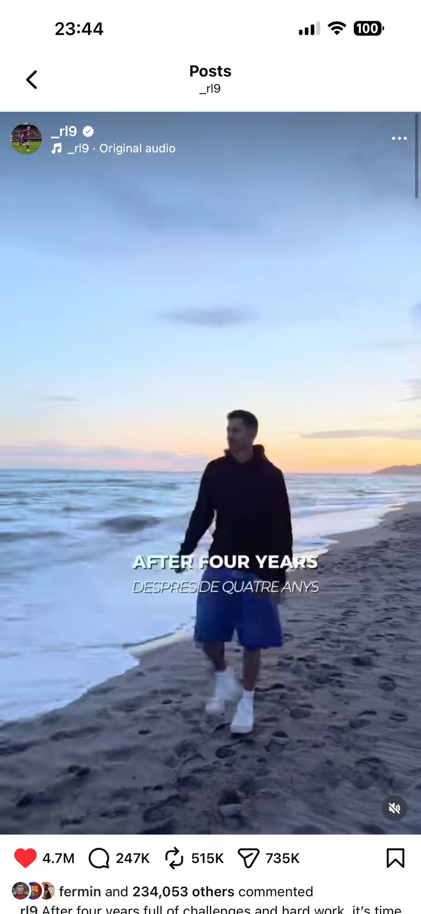

# 了却君王天下事 赢得生前身后名

> 奉任于败军之际，受命于危难之间。

-   

2020年欧冠巴萨2-8惨败拜仁之后，巴萨球迷和拜仁球迷势同水火，剑拔弩张，而你作为拜仁的当家球星，也始终是我心里的一根刺。

然而命运好像总爱开玩笑，两年后的夏天，你转会到昔日的手下败将麾下，那时你在社媒发布了自己在地中海沙滩望向海平面的帖子，向全世界的巴萨球迷致以问候；四年后的今天，轻舟已过万重山，你功成身退，同样是在巴塞罗那的海边，向这座城市依依惜别。

最后的告别贴里，你只字不提自己的贡献，好像你从来没有为这座城市斩关夺隘、摧城拔寨，也没作为领袖拿过任何一个冠军，捧杯大笑。所有的情义、热爱与责任都化作那一句“巴萨已经回到了它应该在的位置，是时候开启新的篇章了”。

-   

看到这一句话我鼻头一酸，想起当年梅西离开巴萨的时候，因为暑假留在二中培训，我竟然过了整整一个星期才知道这件事。或许是因为时空错位，那时我的苦涩不比现在，更多的是震惊，甚至有一种“不破不立”的期待感——巴萨要重建了。但是这一次，我感受到了打心底里离别的苦涩。我们听了太多“一人一城”的忠义故事，那一生的厮守值得我们最崇高的敬意；可或许有时也要好好感谢那些在暴风雨中为我们撑过伞的匆匆过客，他们如星辰般降临，又如侠客般事了拂衣去，就此相忘于江湖。

> *没有句点已经很完美了，何必误会故事没说完...*

-   

