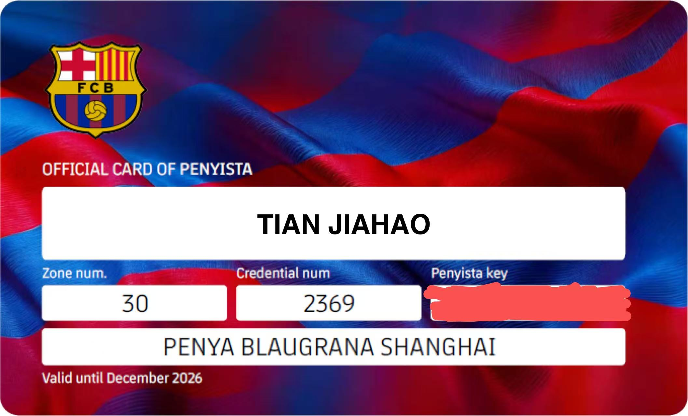

# 序章：不仅仅是一家俱乐部(Més que un club)

> **“深蓝如海，逆境中行舟远航；绛红如血，岁月里铸就忠诚。”**

---

## 🔵 溯源 | Trace

巴塞罗那俱乐部（FC Barcelona）从**1899**年创立至今，横跨一个多世纪的波澜，早已从单纯的体育组织进化为一个文化符号。听说如果你有机会去到巴塞罗那的街头巷尾，坐在一个小酒馆或者咖啡厅，和当地人聊聊天，就会发现他们将巴萨亲切地称为 **"la casa"(我们的家)** 。

在弗朗哥上台后的法西斯统治时期，西班牙陷入了漫长的寒冬。当时的巴萨球员，在面对代表着独裁权利的（如皇家马德里（简称“皇马”））的对手时，时常会受到人身威胁（两队的历史最大比分就是这么出现的）。独裁者试图通过球场来压制西班牙平民的反抗。

但就是这样，代表着平民对法西斯独裁反抗的巴塞罗那最终成长为了一个真正不畏强权的文化符号，始终代表着西班牙国内的一种政治声音。

!!! quote "精神图腾"
    就像在最压抑时代巴萨球迷的一句口号所言：**“白云偶尔会遮住蓝天，但蓝天永远在白云之上”。**

政治硝烟散去，但精神文化的传承历久弥坚。我将在这个板块分享我知道的有关巴萨的温情故事，那是一代又一代流淌着红蓝血液的球迷们的记忆深处的锚点。

## 🔴 羁绊 | Follow

**“不仅仅是一家俱乐部”**，这不仅是一句印在看台上的标语，更是一份关于情怀的宣言。

在这里，我将记录自己作为 Culer 追随球队的印迹。比起参与感，我更想捕捉的是那些在公益或观赛活动中发现的故事。这些故事无关乎我做了什么，而关于红蓝精神是如何在个体之间传递温度的。

---

!!! info "身份铭刻"
    