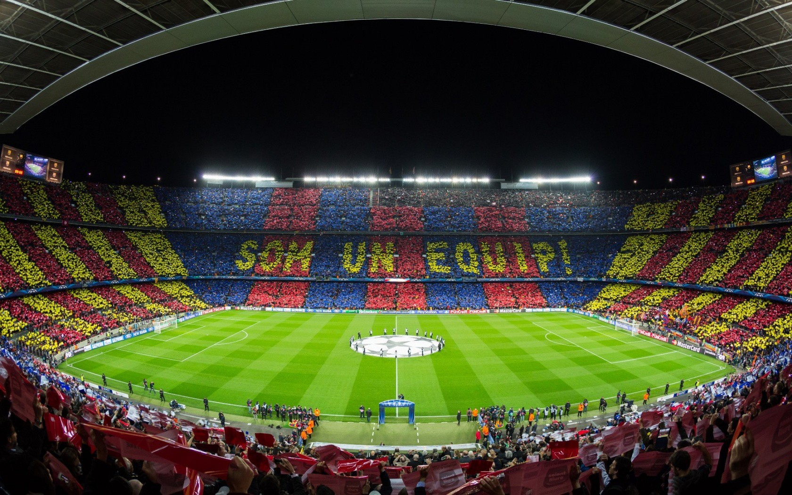
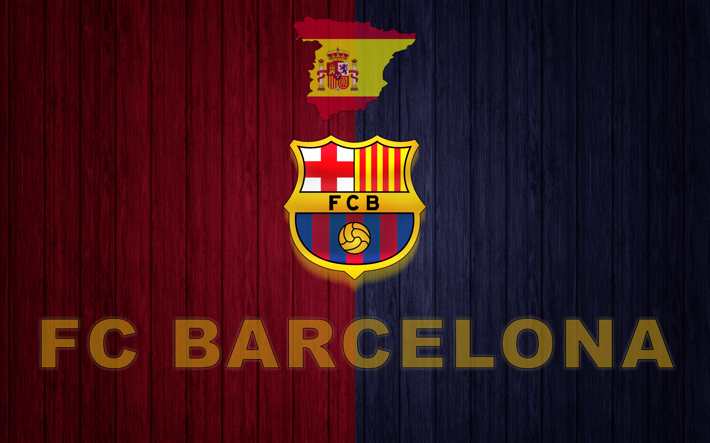

{: style="width: 100%; height: 180px; object-fit: cover; object-position: center 85%;" }

# ✍️ 个人随笔

## 关于我

> "我若等你，又何惧几个秋。"

我不仅会与概率测度和统计方法打交道，我还是一个狂热的足球迷。我有十一年的球龄（大概四年级起），但是现在由于事情繁多、球友陌生等因素已与绿茵场渐行渐远。我始终怀念初中和同班同学踢球的日子，那大抵是我人生目前为止最无忧无虑、没心没肺的时光。还记得我们班在班级联赛斩获冠军，我以五场比赛四粒进球位列全校射手榜第二名。

虽然现在踢球的机会逐渐变少，但就像一句很经典的话说的那样——一个男孩会在他十几岁时选择一只球队并从此坚守一生，我选择的是巴塞罗那。遗憾的是，我开始看足球的那一年巴萨拿到欧冠冠军，直到现在，巴萨都没有再拿过欧冠冠军。不过十年饮冰，难凉热血，我始终坚信那一天终会到来。

我特意在个人笔记主页开设随笔一栏，一来是为了记录生活，给自己放空大脑的空间；二来是可以在此发发牢骚，面对巨大的学业、科研压力，不吐不快。

---

!!! quote "入口声明"
    这是我用来记录日常的树洞，学术与笔记相关的内容请移步别处。这里只谈热爱，只讲情怀，不推公式。

## 📜 记忆存档

* **2026-04-15** | [男人的一生只哭十一次](./posts/private/2026-4-15.md) 🔒
    > *关于 25-26 欧冠四分之一决赛、“下次再来”的循环。*

* **2026-04-23** | [何时收敛](./posts/private/2026-4-23.md) 🔒
    > *对于27fall申请的疲惫、一些对未来的想法以及期中总结*

* **2026-05-05** | [被烫伤的孩子仍然爱火](./posts/public/2026-5-5.md) 
    > *二十岁的青春就在那里，眼里都是十岁时的影子*

* **2026-06-13** | [暂时留白的情感总结](./posts/private/2026-6-13.md) 🔒
    > *考试周前不久分手了，暂时留白...*

  <h3 style="margin-top: 0; font-weight: 600;">⭐⭐⭐ 距离阿根廷捧起大力神杯已过去</h3>
  

    
-- 天

    
-- 时

    
-- 分

    
-- 秒

  

  
"Muchachos, ahora nos volvimos a ilusionar..."

  <h3 style="margin-top: 0; font-weight: 600;">🏆 距离 2026 美加墨世界杯开幕还有</h3>
  

    
-- 天

    
-- 时

    
-- 分

    
-- 秒

  

