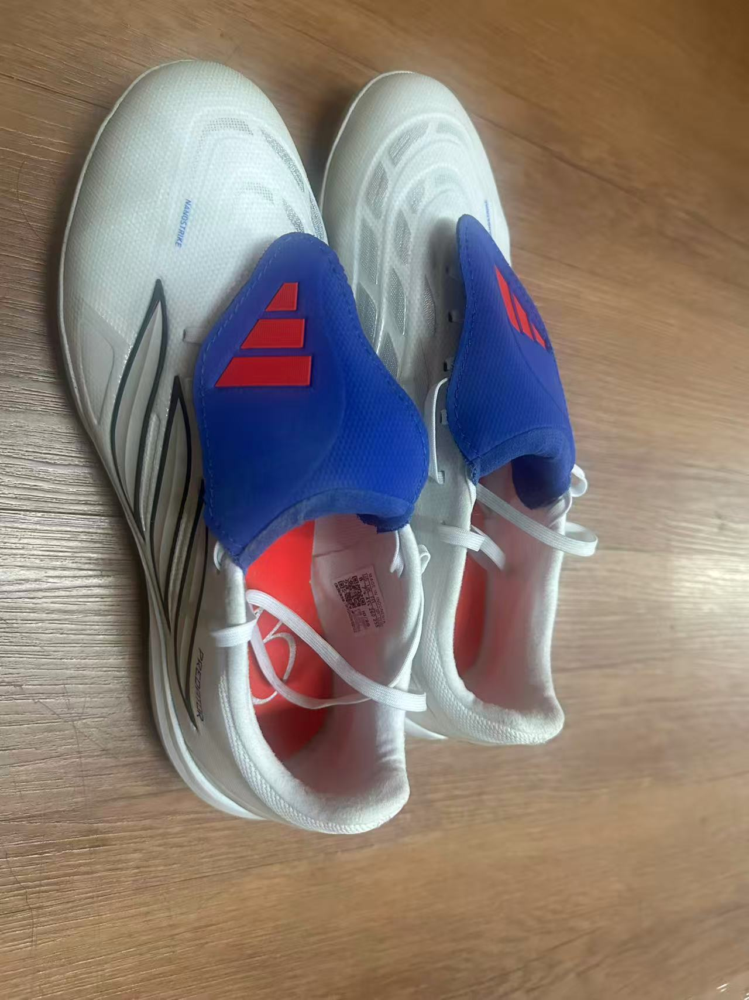
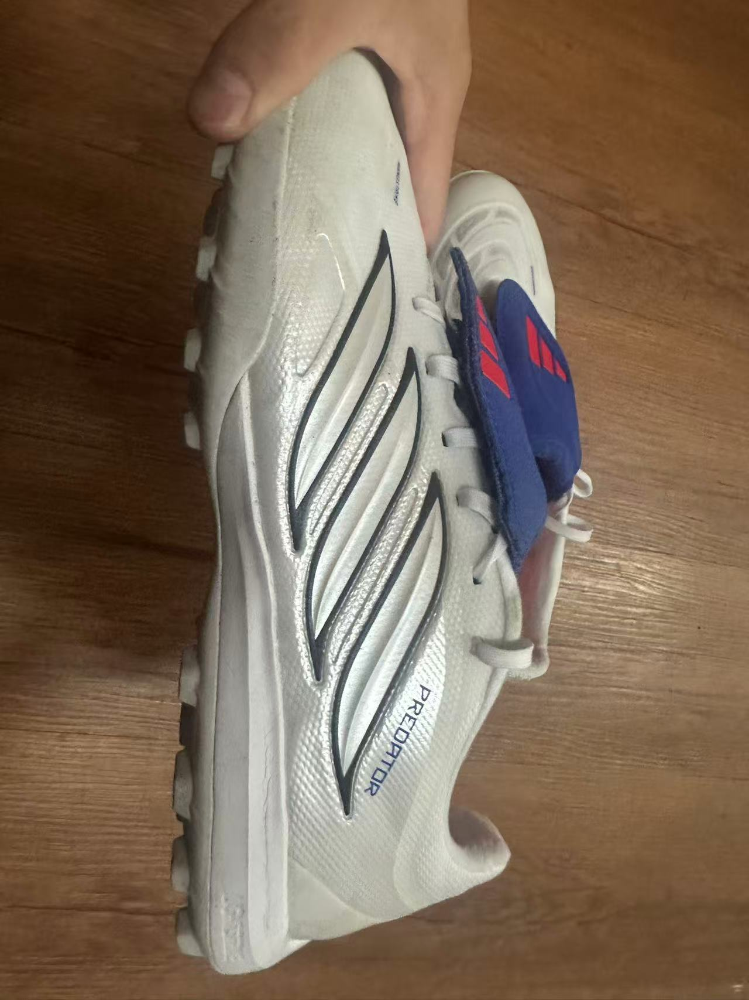

# 重返绿茵

说到为什么会突然想着重返绿茵场开始踢球，还得感谢一下浙大的体测。我发现我相比去年竟然胖了几公斤，我问AI它说我这可能是“过劳肥”，不过我确实觉得我吃的比之前多了，到大二以后也从来没有再跑步打卡过。我之前觉得已经没什么心气踢球了，主要是太累了，事情太多，更想通过乱七八糟的降智小视频获得一些即时的快感，而不是比较耗费心神和体力的足球；二是没有什么球友（私以为踢野球（非正式比赛）的快乐至少50%来源于和谁一起踢）。但是现在我有了更加现实的让我重返绿茵的外在动力——减肥。

我想等大四没事的时候就去数院院队踢球，于是找了找数院足球队的公众号，加了队长的微信。他问我踢什么位置的，我说前腰、影锋、左内锋都行。

正逢五一假期，刚刚结束了泛函的期中还有和暑研老师的meeting，也多少有了一点学习上的惰性，于是就想着趁这个假期处理一下堆起来的杂事、复习一下五一后拓扑的期中考，然后踢踢球。自己刚从抽象的数学中抽离出来，急切地需要一些物理上的“确定感”和“真实感”。之前在物理学院院队的时候加了足球群，jbx学长常在里面组织友谊赛，我好像一次都没有去过，基本只去踢正赛（导致有一次正赛直接把我放在了我完全不会踢的左边后卫位置上，虽然没有被对位的前锋爆掉，但是也很坐牢就是了）。

这次他们在群里组织了5.3号五人制的野球，jbx学长跟我说：“好久不踢了啊！”，我说明天就去踢。但是我想我之前穿的长钉的球鞋打滑、伤膝盖，也觉得那双鞋没有射门靴的感觉，就决定买一双AG/TF的球鞋，可以一直穿到大四去数院足球队踢。

看到网上推荐阿迪的F50系列和猎鹰(Predator)系列，虽然看起来感觉F50更适合我（球鞋更轻）而且好像有梅西的联名，但我突然想到之前有过一双猎鹰300块的入门款球鞋，那双球鞋陪伴了我三四年的时间，一直到高中球鞋踢得有点开胶了我还穿着，直到高中毕业收拾东西的时候不知道谁给我扔了。而且我印象中发挥最好的一场正赛（有一个大禁区外接半高球传球直接吊门远角的进球）就是穿那双猎鹰完成的。然后得到懂球鞋的初中同学肯定的答复后就去黄龙体育中心的足球用品店买了一双猎鹰。回到宿舍以后，我看着刺在球鞋上的"Predator"，突然想起了《天下足球》的一段经典文案也可以套在自己身上——时光的列车缓缓驶过，二十岁我的就坐在那里，眼里全是自己十岁时的影子（怎么突然感觉自己像是老了，二十岁可是我的青春啊拜托）。

-   
-   

球衣方面我就准备穿之前在物院和竺院发的球衣了。其实我之前在adidas实体店的时候看到了梅西2006年世界杯首秀的深蓝色阿根廷客场纪念版球衣，其实当时我是只想买个T恤的，但是那件衣服太吸引我了，狠狠心咬咬牙就买了。不过我是不舍得穿它在野球场上踢球了，我觉得那抹蓝更应该出现在深夜的自习室而不是铺满劣质草皮的野球场。

我其实这学期是选了五人制足球这门课的，不过我选这门课很大的原因是我能很轻松地考核拿到满分，虽然我踢球的强度、频率下滑了不少，但是那12s的绕杆射门我的肌肉记忆还是在的。只不过这种面向全校的课还是难有球技的实质性的进步，划划水也就过去了。

我以为我的球技会比之前退步很多，但穿上那双猎鹰后，怎么说呢，那些肌肉记忆被激活了。十几米开外的抽射还是能让守门员感觉手腕酸痛；还是能从两个防守队员的缝隙中带球抹过去；还是能在背身拿球的时候一个脚后跟磕给队友，换来一句对手的“视野好”。感觉这种快感是降智小视频给不了的，甚至有时有像推了一个小时数学终于推出来的轻盈感。虽然这场我们被对面打爆了，但是我对自己的表现还是非常满意的。只是到最后因为我没吃午饭只带了一块巧克力，导致我感觉还有体力还能跑但是腿已经发软跑不起来了。

校园里微风习习，思绪好像飘回了18年的夏天，那一年姆巴佩横空出世，梅西感受到了“后起之秀”带给他的压力；那时的我还在初中，进球后还会很幼稚地学姆巴佩双手抱胸的庆祝动作，课间就和同学讨论足球（足球可是我们的班级文化），哪怕冒着被班主任骂一顿的风险也要吃完午饭去抢圈玩玩，那时候我和朋友们都说：“要踢一辈子的足球”......

 

  写于 2026 年 5 月 5 日 晚 
  浙江大学紫金港校区 物理学院

